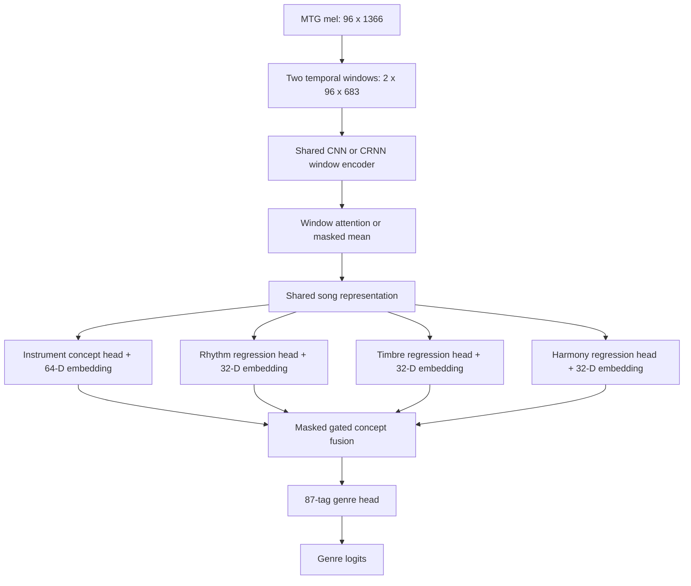

# Project Technical Blueprint

## Concept-Guided Explainable Multi-Label Music Genre Classification

**Audit date:** 8 September 2026  
**Repository state audited:** detached `HEAD` at `origin/thevindu-branch`, commit `2657fbc`  
**Purpose:** one source of truth for understanding the current repository, correcting its architectural inconsistencies, and planning a defensible implementation and research evaluation.

> Read this document before running or changing the notebooks. It distinguishes **implemented and verified**, **implemented but unverified**, **planned**, and **recommended** behavior. Those categories must not be mixed in the paper.

Quick navigation: use Sections 1-3 for orientation, Sections 5-9 to understand the existing system, Section 10 for blockers, Sections 11-13 for the target design and experiments, and Sections 14-19 as the execution plan.

---

## 1. Executive summary

This project aims to classify multiple music genres from an audio track while exposing human-understandable intermediate concepts: instrumentation, rhythm, timbre, and harmony. The intended research claim is that concept-guided representations can improve genre tagging and make predictions easier to explain than a direct CNN.

The repository is currently a **notebook-first research prototype**, not a finished application or reusable ML package. It contains:

- a legacy, executed MTG-Jamendo CNN baseline notebook;
- generated Colab and Kaggle pipelines numbered `00` through `09`;
- reusable but partial Python scaffolds for audio feature extraction and Stage 2 fusion;
- workflow and storage documentation;
- no local dataset, trained checkpoints, generated feature tables, current experiment results, automated tests, dependency lock file, CI workflow, command-line training application, or inference service.

The most important distinction is between the proposed diagram and the code that exists:

| Topic | Intended story | Current implementation |
|---|---|---|
| Input | MP3 decoded once, split into 15-second windows | Official precomputed MTG `raw_30s` mel NPY files; normally one centered 29.1-second, 96-bin spectrogram per track |
| Shared encoder | One CNN learns all four concepts | CNN is used only for the instrument embedding |
| Instrument | Learned concept embedding | Implemented as a 64-dimensional MIL/attention embedding, but the supplied NPY usually creates only one real window |
| Rhythm | Learned rhythm representation | Ten precomputed AcousticBrainz/Essentia scalar features |
| Timbre | Learned timbre representation | Six hand-written mel-array proxy statistics in the canonical Colab path; optional real librosa features in Kaggle/standalone code |
| Harmony | Learned harmony representation | Eighteen mel-array proxies in the canonical Colab path; optional real chroma/Tonnetz from audio elsewhere |
| Fusion | Concatenation plus attention pooling | Either concat-linear in a scaffold/Kaggle notebook or single-head self-attention over four projected concept tokens |
| Explainability | Concept attribution and intervention | A small attention-weight plot and a blank human-listening template; no implemented occlusion experiment |
| Evaluation | F1, precision, recall, BCE, mAP, embeddings | Current generated training notebooks calculate macro ROC-AUC and macro PR-AUC only |

The project is viable, but the current pipeline is not yet sufficient to support the stronger claim that it learns four concept embeddings. The recommended architecture in this document uses a shared audio encoder, supervised concept heads, masked concept fusion, and a joint genre-plus-concept objective. A lower-risk milestone can first reproduce the current hybrid fusion after correcting its data contracts and evaluation.

---

## 2. Research problem

### 2.1 Task definition

The task is **multi-label music genre tagging**. A track may have several genre labels at once, such as `electronic`, `ambient`, and `downtempo`.

For a track \(x\), the model returns one logit per genre:

\[
f_\theta(x) = \mathbf{z} \in \mathbb{R}^{G}
\]

where the official split vocabulary should use \(G=87\) genre tags. Probabilities are computed independently:

\[
\hat{y}_g = \sigma(z_g) = \frac{1}{1 + e^{-z_g}}
\]

This is not softmax classification. Genre probabilities do not need to sum to one.

The binary target vector is \(\mathbf{y}\in\{0,1\}^{G}\). The current loss is unweighted binary cross-entropy with logits:

\[
\mathcal{L}_{genre} = -\frac{1}{G}\sum_{g=1}^{G}
\left[y_g\log\sigma(z_g)+(1-y_g)\log(1-\sigma(z_g))\right]
\]

### 2.2 Research hypothesis

A precise, testable hypothesis should be:

> A genre classifier using explicitly supervised musical concept representations and adaptive, missing-concept-aware fusion improves macro PR-AUC over a matched direct-audio CNN and yields concept interventions that faithfully change predictions on held-out tracks.

This wording requires three kinds of evidence:

1. **Predictive value:** improvement over a matched baseline on the same tracks, tags, split, and training budget.
2. **Architectural value:** ablations show that the gain is attributable to concept supervision and fusion, not merely extra parameters or metadata.
3. **Explanation value:** removing or changing a concept has a measurable, musically plausible effect; attention weights alone are not enough.

### 2.3 Course fit

The course brief in `docs/project-guidelines.md` requires the contribution to be in DNN architecture, learning objective, representation learning, or efficiency. A true concept-supervised shared encoder plus masked adaptive fusion is a valid architectural and representation-learning contribution. The current hybrid of one embedding and three feature vectors is useful as a prototype, but on its own it risks looking like feature engineering rather than a strong DNN contribution.

### 2.4 Non-goals

The project is not presently designed as:

- a single-label genre classifier;
- a music recommendation system;
- a real-time production inference API;
- an LLM or agentic system;
- a full-song streaming model;
- a claim that attention is automatically a causal explanation;
- a full 229 GB MTG-Jamendo run on local storage.

---

## 3. What is authoritative

Use this source-of-truth order when documents disagree:

1. An executed, versioned experiment artifact with its exact code commit, data manifest hash, configuration, checkpoint, and metrics.
2. Current code and notebook cells.
3. This blueprint's audit of that code.
4. Workflow documentation.
5. The root README and proposal diagrams.

At present, only the legacy baseline notebook contains executed training evidence. The generated `00`-`09` Colab and Kaggle notebooks have zero executed code cells and zero saved outputs in Git. Therefore, descriptions of their behavior are code inspection findings, not successful-run evidence.

---

## 4. Repository inventory

### 4.1 Top-level files and directories

| Path | Role | Current status |
|---|---|---|
| `README.md` | High-level proposal, intended architecture, progress summary | Useful introduction, but several statements conflict with code |
| `PROJECT_TECHNICAL_BLUEPRINT.md` | Detailed source of truth and project plan | This document |
| `.gitignore` | Ignores `data/*`, Python caches, macOS metadata | Does not explicitly ignore checkpoints, feature dumps, or results outside `data/` |
| `data/.gitkeep` | Keeps the local data directory in Git | No local data is committed |
| `BaselineModels/DNN_Baseline.ipynb` | Legacy executed genre/instrument CNN work based on the upstream MTG baseline | Only committed notebook containing training metrics |
| `dnn-download-data-0.ipynb` | Legacy executed Kaggle download notebook | Downloaded three mel shards and 1,716 NPY files |
| `notebooks/colab/` | Generated Drive-backed pipeline `00`-`09` | Documented as the preferred current path; unexecuted in Git |
| `notebooks/kaggle/` | Generated Kaggle-output pipeline `00`-`09` | Unexecuted and contains blocking portability/parsing issues |
| `scripts/_generate_colab_notebooks.py` | Source generator for Colab notebooks | 1,353 lines; edits should flow from generator to notebooks |
| `scripts/_generate_kaggle_notebooks.py` | Source generator for Kaggle notebooks | 1,932 lines; edits should flow from generator to notebooks |
| `scripts/colab/` | Older Drive setup/bootstrap helpers | Partial and inconsistent with the newer generated notebook flow |
| `scripts/features/` | Standalone raw-audio rhythm, timbre, and harmony extractors | Syntactically valid; not directly wired to generated manifest schema |
| `scripts/stage2/` | Reusable PyTorch fusion scaffold | Random-input smoke test passes; no real data loader or training loop |
| `docs/` | Workflow, storage, course, and historical research notes | Several dates/status statements are stale |
| `docs/contributor-logs/` | Per-member logs | Four are empty/nearly empty; Thevindu's is detailed |
| `docs/initial-datasets.pdf` | Historical table of ten candidate project directions/datasets | Background only; not the selected music project architecture |
| `docs/research-ideas.pdf` | Historical candidate research memo | Background only; includes environmental audio ideas but not this final design |

Directories shown in the README such as `models/`, `experiments/`, and `results/` do not currently exist in Git.

### 4.2 Notebook map

Both platforms implement the same conceptual stages:

| # | Notebook | Purpose | Required inputs | Intended outputs |
|---:|---|---|---|---|
| 00 | download | Fetch annotations, mel shards, create storage tree | Internet and storage | annotation TSVs, mel NPY files, summary JSON |
| 01 | preprocessing | Match NPY files to official split-0 IDs | 00 | `song_manifest.csv`, manifest summary |
| 02 | CNN baseline | Direct genre tagging from mel | 00, 01 | best checkpoint, history CSV, test JSON |
| 03 | instrument embedding | Instrument-supervised CNN/MIL model | 00, 01 | Stage 1 checkpoint, embeddings NPY, ID JSON |
| 04 | rhythm | Extract AcousticBrainz rhythm fields | 00, 01, Internet/AB data | rhythm CSV, missing-data JSON, summary JSON |
| 05 | timbre | Extract six timbre features | 00, 01; optional audio on Kaggle | timbre CSV |
| 06 | harmony | Extract twelve chroma plus six Tonnetz-like values | 00, 01; optional audio on Kaggle | harmony CSV |
| 07 | fusion | Train genre head over four concept groups | 01 and 03-06 | Stage 2 checkpoint, history CSV, test JSON |
| 08 | ablations | Compare result JSONs and record compute | 02, 07 | comparison, compute, and sweep-plan CSVs |
| 09 | explainability | Plot Stage 2 concept attention and create listening sheet | 01, 03-07 | attention CSV/PNG and qualitative CSV |

### 4.3 Generated-file policy

The two `_generate_*_notebooks.py` files contain the notebook sources as strings. Editing only an `.ipynb` creates drift because a future generator run can overwrite the change. The repository should adopt this rule:

> Generator code is canonical; generated notebooks are checked artifacts. Change the generator, regenerate, inspect the diff, and validate every notebook JSON.

There is currently no automated check that generated notebooks match their generators.

### 4.4 Git state

- Remote: `https://github.com/tharu-jwd/music-genre-classification.git`
- Audited revision: `2657fbc`, `Replace placeholder rhythm and attention with AcousticBrainz and Stage 2 weights.`
- Checkout state: detached at `origin/thevindu-branch`.
- Available branches include `main`, `origin/anupama-experiments-branch`, and `origin/thevindu-branch`.
- The original audit began with a clean worktree.

Before doing new development, create or switch to a named branch. Do not accumulate research changes on a detached `HEAD`.

---

## 5. Dataset and licensing

### 5.1 MTG-Jamendo

The official [MTG-Jamendo repository](https://github.com/MTG/mtg-jamendo-dataset) describes an open music auto-tagging dataset built from Creative Commons-licensed Jamendo tracks and uploader-provided tags.

Important upstream counts are:

| Dataset view | Tracks | Tags/meaning |
|---|---:|---|
| `raw_30s.tsv` | 55,701 | Tracks longer than 30 seconds; the name does not mean each file is a 30-second excerpt |
| `autotagging.tsv` | 55,609 before split filtering | 195 tags across genre, instrument, and mood/theme |
| `autotagging_genre.tsv` | 55,215 | 95 genre tags before split filtering |
| `autotagging_instrument.tsv` | 25,135 | 41 instrument tags before split filtering |
| `autotagging_moodtheme.tsv` | 18,486 | 59 mood/theme tags before split filtering |
| official split vocabulary | 55,525 total-tag tracks | 87 genre, 40 instrument, and 56 mood/theme tags retained across splits |

This project should use **official split-0** and a fixed vocabulary derived from the split files, not reconstruct the vocabulary from whichever shard subset happens to be present.

### 5.2 Annotation format

TSV rows have the logical fields:

```text
TRACK_ID  ARTIST_ID  ALBUM_ID  PATH  DURATION  TAGS...
```

`TAGS` is variable width: each additional tag is another tab-separated field. A track can therefore have more columns than the six-column header. For example, a genre row may end in several values such as `genre---ambient`, `genre---electronic`, and `genre---rock`.

Consequences:

- Do not parse these files with plain `pandas.read_csv(..., sep="\t")` and assume a single `TAGS` column.
- The Colab helper `iter_tsv_rows` is closer to correct because it joins fields from index 5 onward.
- The tag vocabulary must come from the official split/tag list and be sorted or otherwise fixed, then saved with every checkpoint.
- Track IDs should be normalized to seven digits, such as `track_0000948` to `0000948`.

### 5.3 Official mel representation

The upstream [mel generation code](https://github.com/MTG/mtg-jamendo-dataset/blob/master/scripts/melspectrograms.py) specifies:

| Parameter | Value |
|---|---:|
| Audio segment | centered 29.1 seconds unless `--full` is used |
| Sample rate | 12,000 Hz |
| Frame size | 512 samples |
| Hop size | 256 samples |
| Window | Hann |
| Mel bands | 96 |
| Frequency range | 0 to 6,000 Hz |
| Mel warping | Slaney |
| Mel weighting | linear |
| Mel normalization | unit triangular |
| Spectral value | power mel bands converted with `lin2db` |
| Typical tensor used here | approximately `(96, 1366)` |

This directly contradicts the root README example `(12, 128, 469)` and its claim that the repository preprocesses each track into multiple 15-second windows. The downloaded official NPY is normally a two-dimensional mel matrix. Current loaders wrap it as one window, then pad to twelve windows in Stage 1.

### 5.4 Current subset strategy

- The legacy executed downloader used shards `00`, `01`, and `02`, producing 1,716 NPY files.
- Current generated Colab/Kaggle notebook 00 hardcodes shards `00` through `09`.
- `notebooks/kaggle/README.md` recommends three shards because ten may exceed the roughly 20 GB writable Kaggle disk, while other docs instruct users to download ten. This is unresolved.
- A shard subset is a storage partition, not necessarily a statistically designed subset. Results from it must be labeled as subset results and must not be compared as if they used the full official set.

### 5.5 Licensing

According to the upstream repository:

- upstream code is Apache-2.0;
- metadata is CC BY-NC-SA 4.0;
- individual audio tracks have their own Creative Commons licenses;
- the dataset is made available for non-commercial research and academic use.

This repository itself contains no project `LICENSE` file. The README statement “academic research and educational purposes” is not a complete software license. Add a project license only after confirming ownership and compatibility with upstream code and data terms. Never commit or redistribute audio/feature archives without checking their applicable license.

---

## 6. Current data contracts

### 6.1 Storage layouts

Colab uses a persistent Drive root:

```text
/content/drive/MyDrive/MTG_Instrument/
├── annotations/
│   ├── autotagging_genre.tsv
│   ├── autotagging_instrument.tsv
│   └── splits/split-0/*.tsv
├── dataset/
│   ├── logmel_songs/**/*.npy
│   ├── acousticbrainz/**/*.json
│   └── song_manifest.csv
├── features/
│   ├── instrument/instrument_embeddings.npy
│   ├── instrument/song_ids.json
│   ├── rhythm/rhythm_song.csv
│   ├── timbre/timbre_song.csv
│   └── harmony/harmony_song.csv
├── checkpoints/
│   ├── baseline/best.pt
│   ├── stage1/best.pt
│   └── stage2/best_{attention|linear}.pt
└── results/
    ├── 00_download_summary.json
    ├── 01_manifest_summary.json
    ├── 02_baseline_*.{csv,json}
    ├── 04_*.json
    ├── 07_stage2_*.{csv,json}
    ├── 08_*.csv
    └── 09_*.{csv,png}
```

Kaggle intends to use:

```text
/kaggle/input/<previous-notebook-output>/...   # persistent, read-only attached inputs
/kaggle/working/MTG_Instrument/...             # current session, writable
/kaggle/working/mel_cache/...                  # local copies for stable reads
```

### 6.2 Manifest schema

Notebook 01 writes one row per discovered mel:

| Column | Type | Meaning |
|---|---|---|
| `song_id` | zero-padded string | Seven-digit track ID |
| `mel_path` | string | Path relative to the chosen root when possible |
| `mel_abs` | string | Absolute path at manifest-generation time |
| `nbytes` | integer | File size, used only as weak diagnostics |
| `split` | enum | `train`, `validation`, or `test`; `unused` rows are dropped |

Weakness: `mel_abs` is platform/session-specific. The robust contract should store a logical key and relative path, then resolve it under the configured mel root at runtime.

### 6.3 Label tensors

| Tensor | Intended shape | Current construction |
|---|---|---|
| genre target | `(N, 87)` | Dynamically built from the first parseable genre TSV; can become up to 95 columns |
| instrument target | `(N_inst, 40)` | Dynamically built against all genre-manifest songs; can become 41 columns and treats missing annotations as negatives |

Both contracts need correction. The number and order of labels must never depend on downloaded shard composition or file traversal order.

### 6.4 Feature tables

Every feature artifact joins on `song_id` and also carries `source` and `split` in the generated notebooks.

Current rhythm columns from AcousticBrainz are:

1. `bpm`
2. `beats_count`
3. `beats_loudness_mean`
4. `bpm_histogram_first_peak_bpm`
5. `bpm_histogram_first_peak_spread`
6. `bpm_histogram_first_peak_weight`
7. `onset_rate`
8. `danceability`
9. `beat_interval_mean`
10. `beat_interval_std`

Current timbre columns are:

1. `spectral_centroid_mean`
2. `spectral_bandwidth_mean`
3. `spectral_contrast_mean`
4. `spectral_flatness_mean`
5. `rms_mean`
6. `spectral_flux_mean`

Current harmony columns are:

- `chroma_0_mean` through `chroma_11_mean`;
- `tonnetz_0_mean` through `tonnetz_5_mean`.

Stage 2 therefore usually expects concept dimensions `64 + 10 + 6 + 18 = 98`. The reusable scaffold still declares rhythm dimension 5, so its default total is 93. These are different contracts.

### 6.5 Checkpoint schemas

Baseline `best.pt` contains:

```python
{
    "model": state_dict,
    "tags": TAG_NAMES,
    "best_macro_map": float,
    "epoch": int,
}
```

Stage 1 `best.pt` contains the same keys for instrument tags. Stage 2 `best_attention.pt` or `best_linear.pt` contains:

```python
{
    "model": state_dict,
    "fusion": "attention" or "linear",
    "best_macro_map": float,
    "tags": TAG_NAMES,
}
```

Missing from all checkpoints are the code commit, data-manifest hash, feature column order, feature scaler, model hyperparameters, random seed, optimizer state, scheduler state, and full evaluation configuration. Without these, exact reproduction is fragile.

---

## 7. Current pipeline, stage by stage

### 7.1 Notebook 00: acquisition

The notebook:

1. checks Internet access;
2. creates the runtime folder tree;
3. downloads eight annotation files from the upstream GitHub repository;
4. downloads and extracts mel archives;
5. deletes archives after extraction;
6. writes `.shard_XX_done` marker files;
7. writes a JSON summary.

Colab writes directly to Drive. Kaggle writes to `/kaggle/working`, after which the user must save a notebook version and attach its output to later notebooks.

Technical limitations:

- no archive checksum or expected-file-count verification;
- no validation of every NPY by default (`SCAN_MELS=False` later);
- ten shards may exceed Kaggle disk;
- Colab helper script downloads only three shards, while the generated notebook downloads ten;
- the repository does not download MP3s or run the README's “decode exactly once then delete MP3” flow.

### 7.2 Notebook 01: manifest and splits

It recursively finds `.npy` files, extracts a seven-digit ID from each stem, removes duplicate IDs, loads split-0 train/validation/test IDs, asserts pairwise disjointness, labels each mel, drops `unused`, and writes the manifest.

Good properties:

- the split-leakage assertion is explicit;
- split assignment is deterministic;
- one mel is loaded for a shape sanity check.

Limitations:

- it does not assert that all expected IDs are present;
- it does not report missing IDs by split or label prevalence;
- it does not verify artist disjointness from metadata;
- it does not create a stable manifest checksum;
- Kaggle's `load_split_ids` uses a plain pandas TSV parser that is incompatible with variable-width tag rows;
- Colab contains a harmless duplicated `return "validation"` statement.

### 7.3 Notebook 02: compact CNN baseline

#### Input transformation

The loader expects up to twelve windows but normally receives a 2-D `(96, 1366)` NPY. It adds a leading singleton window axis. If multiple windows did exist, it would keep twelve, zero-pad missing windows, and average all twelve before the CNN. This averaging includes zero padding and would reduce amplitude for tracks with fewer than twelve windows.

It then forces the result to exactly 96 mel bins and 1,366 frames by transposition, truncation, or zero padding.

#### Network

For 87 output tags, the model has approximately **640,023 trainable parameters**:

| Layer | Output shape from `(B,1,96,1366)` | Notes |
|---|---|---|
| Conv 3x3, 1→32 + BN + ReLU | `(B,32,96,1366)` | padding 1 |
| MaxPool 2x2 | `(B,32,48,683)` | floor division in time |
| Conv 3x3, 32→64 + BN + ReLU | `(B,64,48,683)` | |
| MaxPool 2x2 | `(B,64,24,341)` | |
| Conv 3x3, 64→128 + BN + ReLU | `(B,128,24,341)` | |
| Adaptive average pool | `(B,128,4,4)` | |
| Flatten + Linear 2048→256 + ReLU + Dropout | `(B,256)` | dropout 0.3 |
| Linear 256→G | `(B,G)` | logits |

#### Training

- optimizer: Adam;
- learning rate: `1e-3`;
- loss: unweighted `BCEWithLogitsLoss`;
- batch size: 16;
- epochs: 10;
- model selection: highest validation macro PR-AUC;
- evaluation: sigmoid probabilities, macro ROC-AUC, macro PR-AUC;
- undefined single-class tag metrics are excluded from the macro mean.

There is no scheduler, early stopping, class weighting, data augmentation, mixed precision, gradient clipping, threshold calibration, or repeated-seed evaluation.

### 7.4 Notebook 03: Stage 1 instrument embedding

#### Intended logic

Each track is a bag of mel windows. A shared window CNN creates a 64-D representation per window. A learned scalar score and masked softmax pool the windows. A linear head predicts instrument tags, and the pooled 64-D vector becomes the exported instrument embedding.

#### Network

For 40 instrument tags, it has approximately **25,641 trainable parameters**:

```text
(B,W,1,96,1366)
  → reshape to (B×W,1,96,1366)
  → Conv 1→32, ReLU, MaxPool2d(2)
  → Conv 32→64, ReLU, AdaptiveAvgPool2d(1,1)
  → Linear 64→64 per window
  → score Linear 64→1
  → masked softmax across W
  → weighted sum z_inst ∈ R^64
  → Linear 64→40 instrument logits
```

#### Training

- optimizer: Adam, `1e-3`;
- loss: unweighted BCE with logits;
- batch size: 8;
- epochs: 8;
- selection: validation macro average precision;
- export: embedding for every manifest row, including validation and test inference.

#### Critical semantic problem

Official NPY files are normally 2-D. The loader converts each to `W=1`, pads to `W=12`, runs the CNN on all twelve positions, masks eleven, and gives the single real position attention weight 1.0. Thus the model is not performing meaningful multi-instance attention and wastes roughly twelvefold window-encoder compute on padding.

#### Critical label problem

The manifest is created from the genre subset. Stage 1 creates an all-zero instrument target for every manifest track absent from `autotagging_instrument.tsv`. Absence of an instrument annotation is not proof that every instrument is absent. This introduces false negatives and should be fixed by training only on tracks in the official instrument split or by using an explicit label-observation mask.

The code also derives tags from the full 41-tag file instead of fixing the official 40-tag split vocabulary.

### 7.5 Notebook 04: rhythm

Notebook 04 now uses AcousticBrainz/Essentia JSON rather than a constant mel-proxy tempo. It downloads corresponding `raw_30s_acousticbrainz-00..09` archives, indexes JSON files by track ID, and extracts the ten fields listed in Section 6.4.

Rows without JSON or without `rhythm.bpm` are excluded and recorded in `04_missing_acousticbrainz.json`. Stage 2 then performs an inner intersection, so missing rhythm data removes a song from all Stage 2 experiments.

Risks:

- added storage/download cost is not included consistently in platform planning;
- no missing-value rate per column is reported;
- missing scalars become NaN and later become zero without a missingness mask;
- distribution and units are not standardized;
- subset selection may change class prevalence and comparability.

### 7.6 Notebook 05: timbre

The standalone extractor computes valid librosa features from raw audio over non-overlapping 15-second windows and averages windows per song. Kaggle can do the same when MP3 files are attached. The canonical Colab notebook, and Kaggle without MP3s, uses a mel proxy.

The proxy treats the downloaded dB mel array as if it were a non-negative magnitude spectrum. This is technically unsafe:

- weighted “centroid” uses normalized mel-bin index, not frequency in hertz;
- dB values may be negative, so the weighted sum and denominator are not physical energy;
- `log(S + 1e-6)` can be invalid for negative dB values, making flatness NaN;
- RMS of dB values is not waveform RMS;
- “spectral flux” is a mean difference of band-averaged dB values, not the stated feature definition.

These values may still act as arbitrary summary statistics, but they should not be presented as faithful standard timbre descriptors.

### 7.7 Notebook 06: harmony

The standalone/audio path computes `chroma_stft`, harmonic separation, and six-dimensional Tonnetz features with librosa, averaged across 15-second windows.

The canonical mel-proxy path splits 96 ordered mel-frequency bins into twelve contiguous bands and calls their normalized means “chroma.” Chroma requires folding frequencies across octaves into pitch classes; twelve adjacent frequency bands are not twelve pitch classes. The six cosine projections are therefore not Tonnetz. This is a blocking scientific-validity issue if the paper claims harmony or tonal features.

### 7.8 Notebook 07: Stage 2 fusion

Stage 2 intersects IDs present in instrument embeddings plus rhythm, timbre, and harmony tables. NaNs are replaced with zero. Features are not standardized.

#### Linear fusion

```text
concat [64-D instrument, 10-D rhythm, 6-D timbre, 18-D harmony]
  → 98-D vector
  → Linear 98→128
  → ReLU
  → Dropout(0.2)
  → Linear 128→G
```

For `G=87`, this has approximately **23,895 parameters**.

#### Attention fusion

```text
instrument 64 → Linear → token 64
rhythm     10 → Linear → token 64
timbre      6 → Linear → token 64
harmony    18 → Linear → token 64
stack → (B,4,64)
single-head self-attention → (B,4,64), weights (B,4,4)
mean over four query outputs → (B,64)
Linear 64→128 → ReLU → Dropout(0.2)
Linear 128→G
```

For `G=87`, this has approximately **42,711 parameters**.

#### Training

- optimizer: Adam, `1e-3`;
- loss: unweighted BCE with logits;
- batch size: 32;
- epochs: 15;
- default fusion: attention;
- selection: best validation macro PR-AUC;
- reporting: split-0 test macro ROC-AUC and macro PR-AUC.

Major limitations:

- no train-only standardization, despite radically different feature units;
- zero imputation is indistinguishable from a legitimate zero;
- no modality mask or modality dropout;
- no class weighting or imbalance analysis;
- no end-to-end fine-tuning; Stage 1 and feature extraction are frozen;
- no matched parameter-control model;
- no protection if validation PR-AUC is NaN or never exceeds zero;
- only the selected default is trained per run; “linear vs attention” requires separate manual reruns.

### 7.9 Notebook 08: ablations and compute

The notebook title promises concept-count, fusion-type, learning-rate/batch-size tuning, and computational analysis. Its actual implementation only:

- collects existing baseline and Stage 2 test JSONs;
- inserts the legacy `0.7260 / 0.1592` reference row;
- computes parameters and dummy latency for a single `Linear(d,87)` toy model;
- writes six unexecuted sweep configurations with status `todo`.

It does **not** train ablations, run a sweep, measure the real models, or calculate statistical uncertainty.

### 7.10 Notebook 09: explainability

It loads a real attention checkpoint, selects the first twelve overlapping test IDs, averages each `(4×4)` self-attention matrix across query tokens to obtain four key weights, writes them, plots mean weights, and creates five blank human-listening rows.

Limitations:

- the first twelve IDs are not a stratified or random documented sample;
- attention weights are descriptive, not necessarily faithful feature importance;
- the promised concept-occlusion delta is not implemented;
- no genre-specific attribution is produced;
- no uncertainty, stability, or comparison to a second explanation method is produced;
- human evaluation protocol, annotators, rubric, and agreement are undefined.

---

## 8. Standalone Python modules

### 8.1 `scripts/features/extract_rhythm_timbre.py`

This script expects a CSV with `song_id` and a raw-audio relative path. It loads each file mono at its native sample rate, processes complete non-overlapping 15-second windows, emits combined window rows, and averages numeric columns by song. It writes:

- `rhythm/rhythm_timbre_windows.csv` containing both families at window level;
- `rhythm/rhythm_song.csv` containing five rhythm dimensions;
- `timbre/timbre_song.csv` containing six timbre dimensions.

The generated manifest has `mel_path`/`mel_abs`, not a raw-audio `path`, so the script is not plug-and-play with notebook 01. Its `spectral_flux_mean` is an onset-strength proxy.

### 8.2 `scripts/features/extract_harmony.py`

This script has the same raw-audio manifest contract. It calculates twelve mean chroma values and six mean Tonnetz values per complete 15-second window, then song means. It writes `harmony_windows.csv` and `harmony_song.csv`.

### 8.3 `scripts/stage2/fusion_and_genre_classifier.py`

This is a reusable model-only scaffold with:

- `ConceptDims(instrument=64, rhythm=5, timbre=6, harmony=18)`;
- `LinearFusion`;
- `AttentionFusion`;
- `GenreClassifierHead` with default 87 tags;
- `Stage2Model` returning `(logits, attention_or_none)`;
- a BCE helper;
- a random-tensor smoke test.

The smoke test passes locally for both fusion types. With the notebook's ten-dimensional rhythm contract, measured parameter counts are 23,895 linear and 42,711 attention. The module has no feature loader, scaler, train/eval loop, checkpoint metadata, or CLI.

### 8.4 Colab helpers

`01_one_time_drive_setup.py` creates the Drive tree, optionally downloads three mel shards, clones the upstream baseline, and intentionally stops before copying code so the three historical fixes can be applied. `SHARD_URLS` is declared but unused.

`02_session_bootstrap.py` mounts Drive, copies all mels to `/content/local_mels`, exports environment variables, and can copy checkpoint directories back to Drive. Its `cp -r <local_dir> <stage_dir>` behavior can produce an extra nested directory depending on the source name.

These helpers describe a local-SSD training flow, while generated Colab notebooks read via `load_mel_npy` and cache individual arrays. Select one operational approach and remove the other ambiguity.

---

## 9. Existing experimental evidence

### 9.1 Legacy download

`dnn-download-data-0.ipynb` was executed successfully on Kaggle on 19 August 2026. It downloaded eight annotation files and mel shards 00-02 and reported **1,716 NPY files**.

### 9.2 Legacy CNN runs

`BaselineModels/DNN_Baseline.ipynb` patches and runs the upstream MTG baseline for 500 epochs on the three-shard subset. Committed outputs include:

| Experiment | Test macro ROC-AUC | Test macro PR-AUC | Notes |
|---|---:|---:|---|
| Genre, training batch 32 | 0.6916 | 0.1373 | Three-shard subset |
| Instrument, training batch 32 | 0.6417 | 0.1678 | Three-shard subset |
| Genre, training batch 16 | **0.7260** | **0.1592** | Best committed genre result; later reused as “paper ref” |
| Genre, training batch 64 | not available | not available | Training began; no completed committed test result |

These values are genuine notebook outputs, but they are not yet a fully reproducible benchmark because the notebook modifies a freshly cloned upstream repository in place, does not save the patched upstream source in this repo, does not record package versions, and does not attach a manifest hash/checkpoint.

The generated baseline differs materially: compact custom network, ten epochs rather than 500, dynamic label vocabulary, and potentially ten shards. Its future result must not be treated as directly comparable until the experimental protocol is matched.

### 9.3 What has not been demonstrated

There is no committed execution evidence for:

- the generated baseline;
- Stage 1 MIL embeddings;
- AcousticBrainz overlap;
- timbre or harmony tables;
- Stage 2 linear or attention fusion;
- any ablation or tuning sweep;
- attention explanations;
- an improvement over `0.7260 / 0.1592`.

---

## 10. Blocking defects and risk register

### 10.1 P0: must fix before trusting any new result

| ID | Problem | Impact | Required correction |
|---|---|---|---|
| P0-1 | Kaggle uses plain pandas parsing on variable-width TSV rows | Split and label parsing can fail with `ParserError` or lose tags | Use one tested line parser for both platforms; join columns 5 onward |
| P0-2 | Kaggle bootstrap does not discover/copy attached feature, checkpoint, and result artifacts into `FEAT_DIR`, `CKPT_DIR`, `RESULTS_DIR` | Fresh notebook 07-09 sessions cannot follow the documented Add Input chain | Resolve every artifact from all attached inputs or explicitly copy small artifacts to working |
| P0-3 | Full TSV creates 95 genre/41 instrument tags instead of official split 87/40 | Metrics and checkpoints are not comparable to the official task | Load and freeze split vocabulary; assert exact names/count/order |
| P0-4 | Instrument-unannotated genre tracks become all-negative targets | Severe false-negative label noise | Restrict Stage 1 to official instrument rows or use observation masks |
| P0-5 | “Twelve 15-second windows” are actually one 29.1-second mel plus eleven padded windows | MIL attention is degenerate and compute is wasted | Define a real windowing contract over the mel time axis or remove the MIL claim |
| P0-6 | Mel-proxy harmony is not chroma or Tonnetz | Invalid scientific claim | Extract from audio or create mathematically valid chroma from a suitable spectral representation |
| P0-7 | Mel-proxy timbre treats dB values as positive magnitude | NaNs and physically invalid features | Convert dB back to power where valid and use correct frequency mappings, or extract from audio |
| P0-8 | No feature normalization before Stage 2 | Scale dominates optimization and attention projections | Fit scalers on training rows only; persist and apply unchanged to val/test |
| P0-9 | Baseline and proposed model do not share a locked protocol | Improvement claims can be confounded by data/tags/epochs | Build one manifest, vocabulary, evaluator, seeds, and budget used by every model |

### 10.2 P1: required for a defensible paper

| ID | Problem | Correction |
|---|---|---|
| P1-1 | No actual ablation loop | Implement automated configurations and store one row per run |
| P1-2 | No concept occlusion despite notebook claim | Zero/mask one standardized concept at a time and evaluate delta metrics |
| P1-3 | Attention is treated as explanation | Pair attention with interventions, gradients, and human evaluation |
| P1-4 | No torch/CUDA seeds or repeated runs | Set all seeds and report at least 3, preferably 5, runs |
| P1-5 | No class imbalance strategy | Compare unweighted BCE with `pos_weight`, focal/asymmetric loss, or balanced sampling without changing test metrics |
| P1-6 | No threshold calibration | Select global or per-tag thresholds on validation only, then freeze for test F1/precision/recall |
| P1-7 | Missing features silently become zero | Add masks; measure missingness; use train-only imputation |
| P1-8 | Inner join silently changes the test cohort | Freeze and report a Stage 2 eligible manifest; compare baseline on that same cohort |
| P1-9 | Checkpoints lack provenance | Save config, columns, scalers, manifest hash, Git SHA, seed, optimizer, epoch, and metrics |
| P1-10 | Current 08 compute values are from a toy layer | Benchmark actual end-to-end models with warm-up and synchronized GPU timing |
| P1-11 | No automated tests/CI | Add unit, contract, leakage, and smoke tests |

### 10.3 P2: engineering and maintainability

- no `requirements.txt`, `pyproject.toml`, lock file, or container definition;
- no schema validation for CSV/JSON/NPY artifacts;
- no configuration system; hyperparameters are embedded in notebooks;
- repeated model and parser implementations can drift;
- no logging framework or stable experiment ID;
- no checksum/index for large artifacts;
- no explicit ignore rules for `features/`, `checkpoints/`, and `results/`;
- README directory tree is partially fictional;
- dates such as “Phase 2 due 23 Aug” are past and should be archived or updated;
- proposal `.tex`/`.bib` files referenced in docs are not in this repository;
- project authors and contributor ownership are incomplete.

---

## 11. Recommended target architecture

> **Historical planning note:** this section predates the implemented v0.3
> predicted-concept fusion contract. The authoritative current architecture is
> [`docs/architecture.md`](docs/architecture.md): primary fusion uses predicted
> instrument `(B,40)`, rhythm `(B,10)`, timbre `(B,35)`, and masked-pooled chroma
> `(B,12)` values, each projected to 64D. The embedding route below is retained
> only as the versioned `embedding_fusion` ablation.

### 11.1 Two-stage delivery strategy

Use two explicit milestones.

**Milestone A — reliable hybrid baseline:** one learned instrument embedding plus correctly extracted and train-standardized rhythm, timbre, and harmony features. This repairs the current work quickly and establishes whether the concept groups contain useful signal.

**Milestone B — research model:** a shared audio encoder with four concept-supervised branches, masked adaptive fusion, and joint learning. This is the architecture to present as the proposed DNN contribution.

Do not describe Milestone A as four learned embeddings.

### 11.2 Canonical input contract

Use each official `(96,1366)` centered 29.1-second dB mel. Convert it into two deterministic temporal windows:

```text
(96,1366) → (2,96,683)
```

Each half is about 14.57 seconds at 12 kHz with hop 256. This makes the “approximately 15-second windows” statement true without inventing data or padding eleven empty windows. For training augmentation, optionally sample overlapping 683-frame windows, but validation/test must use a deterministic policy such as two halves and mean/attention aggregation.

Preserve the unmodified input. Normalize mel values using training-set statistics only or a documented per-example transform consistent across all models.

### 11.3 Proposed model



Recommended tensor contract:

| Symbol | Shape | Meaning |
|---|---|---|
| `X` | `(B,2,1,96,683)` | Two mel windows |
| `H_w` | `(B,2,128)` | Shared window embeddings |
| `h_song` | `(B,128)` | Aggregated song embedding |
| `z_inst` | `(B,64)` | Instrument concept embedding |
| `z_rhythm` | `(B,32)` | Rhythm concept embedding |
| `z_timbre` | `(B,32)` | Timbre concept embedding |
| `z_harmony` | `(B,32)` | Harmony concept embedding |
| `M` | `(B,4)` | Concept availability mask |
| `Z` | `(B,4,64)` | Concepts projected to a common token dimension |
| `h_fused` | `(B,128)` | Fused representation |
| `genre_logits` | `(B,87)` | Multi-label output |

### 11.4 Concept supervision

Concept targets should supervise embeddings rather than be inserted only as final inputs:

- **Instrument:** official 40-tag multi-label vector with an observation mask.
- **Rhythm:** standardized AcousticBrainz values such as BPM, onset rate, danceability, and beat statistics; use masked Huber loss because fields can be missing/outlying.
- **Timbre:** validated audio or Essentia descriptors, standardized; masked Huber/MSE.
- **Harmony:** real chroma/Tonnetz-derived descriptors or musically justified tonal targets; masked regression loss.

The combined objective can be:

\[
\mathcal{L} = \mathcal{L}_{genre}
+ \lambda_i\mathcal{L}_{instrument}
+ \lambda_r\mathcal{L}_{rhythm}
+ \lambda_t\mathcal{L}_{timbre}
+ \lambda_h\mathcal{L}_{harmony}
+ \lambda_c\mathcal{L}_{consistency}
\]

Start with each concept loss normalized to a comparable scale. Tune lambdas on validation data; do not use test results to select them.

### 11.5 Masked gated fusion

For each projected concept token \(u_k\), learn a gate:

\[
a_k = \mathrm{softmax}(s_k + \log m_k)
\]

where \(m_k\) is 1 when the concept is available and 0 when missing. The fused concept representation is:

\[
z = \sum_k a_k u_k
\]

Use modality/concept dropout during training so the system remains usable when a concept target or extracted feature is missing. Compare this gated fusion to concatenation and the current single-head attention.

### 11.6 Why this is a stronger contribution

- all concept spaces are learned from audio and explicitly supervised;
- the model remains end-to-end differentiable;
- missing-concept behavior is part of the architecture and experiment design;
- concept interventions are naturally defined;
- it directly addresses architecture, representation learning, and explainability;
- it can still run on free GPUs because the shared encoder is compact and the concept heads are small.

### 11.7 Lower-risk hybrid architecture

If time prevents Milestone B, retain frozen inputs but make the claim precise:

```text
64-D learned instrument vector
10-D standardized AcousticBrainz rhythm vector
 6-D validated timbre vector
18-D validated harmony vector
 + four availability masks
 → per-concept MLP projections to 32 or 64 dimensions
 → gated fusion with concept dropout
 → 128-D fused representation
 → 87-tag genre logits
```

This should be called **hybrid concept-feature fusion**, not a shared concept-embedding network.

---

## 12. Recommended software architecture

Move reusable logic out of notebooks:

```text
music-genre-classification/
├── pyproject.toml
├── configs/
│   ├── data.yaml
│   ├── baseline.yaml
│   ├── stage1.yaml
│   └── stage2.yaml
├── src/music_genre/
│   ├── data/
│   │   ├── annotations.py
│   │   ├── manifest.py
│   │   ├── mels.py
│   │   ├── features.py
│   │   └── datasets.py
│   ├── models/
│   │   ├── encoder.py
│   │   ├── baseline.py
│   │   ├── concepts.py
│   │   └── fusion.py
│   ├── training/
│   │   ├── losses.py
│   │   ├── metrics.py
│   │   ├── engine.py
│   │   └── checkpoint.py
│   ├── evaluation/
│   │   ├── ablations.py
│   │   ├── explainability.py
│   │   └── bootstrap.py
│   └── cli.py
├── tests/
│   ├── test_annotations.py
│   ├── test_splits.py
│   ├── test_mels.py
│   ├── test_feature_contracts.py
│   ├── test_models.py
│   └── test_metrics.py
├── notebooks/
│   ├── colab/
│   └── kaggle/
├── artifacts/                 # gitignored; small metadata only may be tracked
├── docs/
└── README.md
```

Notebooks should become thin orchestration and visualization layers that import tested functions. This eliminates the current duplicated parser/model/evaluator implementations.

### 12.1 Configuration schema

Every run should serialize a config resembling:

```yaml
run:
  seed: 42
  git_sha: <automatic>
data:
  split: 0
  genre_vocab: official_87
  manifest_sha256: <automatic>
  mel_shape: [96, 1366]
  windows: 2
  window_frames: 683
model:
  name: concept_gated
  shared_dim: 128
  concept_dims: {instrument: 64, rhythm: 32, timbre: 32, harmony: 32}
  token_dim: 64
  fused_dim: 128
training:
  epochs: 50
  batch_size: 16
  optimizer: adamw
  learning_rate: 0.0003
  weight_decay: 0.0001
  early_stopping_patience: 7
  selection_metric: macro_pr_auc
loss:
  genre: bce
  lambda_instrument: 1.0
  lambda_rhythm: 0.2
  lambda_timbre: 0.2
  lambda_harmony: 0.2
```

Values above are starting points, not final conclusions.

### 12.2 Artifact identity

Use a run directory such as:

```text
artifacts/runs/<timestamp>_<model>_<seed>/
├── config.yaml
├── environment.txt
├── manifest.sha256
├── vocabulary.json
├── feature_schema.json
├── scaler.joblib
├── best.pt
├── history.csv
├── val_metrics.json
├── test_metrics.json
└── per_tag_metrics.csv
```

Test metrics should be created once after model selection and never used for iterative tuning.

---

## 13. Evaluation protocol

### 13.1 Dataset cohort

1. Parse official split-0 with one shared parser.
2. Freeze `genre_vocab.json` to the official 87 tags and `instrument_vocab.json` to 40 tags.
3. Build and hash one base manifest.
4. Build and hash one Stage 2 eligible manifest after feature availability decisions.
5. Evaluate every comparison model on the exact same eligible test IDs.
6. Report both the number retained and exclusions by reason/split.

### 13.2 Primary and secondary metrics

Use:

- **Primary:** macro average precision / macro PR-AUC, because the task is highly imbalanced.
- **Secondary ranking metrics:** macro ROC-AUC and micro average precision.
- **Threshold metrics:** macro F1, micro F1, precision, and recall after selecting thresholds on validation only.
- **Calibration:** Brier score or expected calibration error if probabilities are interpreted.
- **Per-tag:** support, AP, ROC-AUC, precision, recall, and F1.

Undefined tag metrics must be reported as undefined and excluded from macro means. Also report how many tags contributed to each macro value.

The present code calls `sklearn.metrics.average_precision_score`. Strictly, this is **average precision (AP)**, a weighted summary of the precision-recall curve, not trapezoidal integration of that curve. Use “macro AP” in stored schemas and the paper, or define exactly what “PR-AUC” means; do not silently alternate the terms.

### 13.3 Repeated runs and uncertainty

Run at least seeds `42`, `43`, and `44`; five seeds are preferable. Report mean and standard deviation. For the final baseline-vs-proposed comparison, use paired bootstrap resampling of test tracks to produce 95% confidence intervals for metric differences.

### 13.4 Required experiment matrix

| ID | Model | Purpose |
|---|---|---|
| B0 | Reproduced upstream CNN | Anchor against prior implementation |
| B1 | Compact direct-audio CNN | Matched codebase/budget baseline |
| H0 | Instrument embedding only | Value of learned instrument concept |
| H1 | Engineered rhythm+timbre+harmony only | Value of non-instrument concepts |
| H2 | All concepts, concatenation | Simple hybrid fusion baseline |
| H3 | All concepts, current attention | Tests attention against concat |
| P0 | All learned concept branches, concat | Tests concept supervision without adaptive fusion |
| P1 | Learned concepts + gated/attention fusion | Full proposed model |
| P2 | P1 with concept dropout | Missing-concept robustness |

### 13.5 Ablations

At minimum:

- remove each concept one at a time;
- incrementally add concepts;
- no concept auxiliary losses;
- each auxiliary loss separately;
- concatenation vs current attention vs gated fusion;
- no modality dropout vs modality dropout;
- one window vs two true windows;
- same parameter budget control;
- frozen encoder vs joint fine-tuning;
- unweighted BCE vs selected imbalance-aware loss.

### 13.6 Explainability evaluation

Use three complementary levels:

1. **Global:** average gates/attention and concept ablation deltas across the test set.
2. **Genre-specific:** concept contribution for each genre, not only overall averages.
3. **Track-level:** selected examples with predicted genres, concept targets/predictions, gates, occlusion deltas, and listening notes.

Faithfulness test:

- measure original genre probability;
- mask one concept with the same mechanism used during training;
- measure the probability change for each genre;
- compare attention/gate rank with absolute occlusion effect;
- report rank correlation and failure cases.

Human evaluation should define sample selection, at least two annotators if possible, a fixed rubric, blind presentation where feasible, and agreement such as Cohen's kappa or Krippendorff's alpha.

### 13.7 Compute evaluation

For each model report:

- trainable parameter count;
- model/checkpoint size;
- peak GPU memory;
- training seconds per epoch;
- total training time to selected checkpoint;
- batch and per-track inference latency after warm-up;
- hardware and software versions.

Use `torch.cuda.synchronize()` around GPU timing. Do not use the dummy `Tiny` model timing as project evidence.

---

## 14. Test plan

### 14.1 Data tests

- variable-width rows preserve every tag;
- normalized IDs are seven digits and unique in a manifest;
- train, validation, and test ID sets are pairwise disjoint;
- vocabulary equals the expected 87/40 tags in exact order;
- every manifest mel resolves under an allowed root;
- NPY dtype is numeric, rank/shape is supported, and values are finite or explicitly handled;
- windowing `(96,1366) → (2,96,683)` is deterministic and covers all frames exactly;
- Stage 1 contains only observed instrument labels;
- feature tables have unique IDs and the declared numeric columns;
- scalers fit only training rows;
- eligible cohort counts and exclusions are stable.

### 14.2 Model tests

- baseline output is `(B,87)`;
- concept model output, concept predictions, masks, and attention shapes match contracts;
- masked concepts receive zero fusion probability;
- all-missing concepts fail clearly or use a documented fallback;
- BCE is finite for a synthetic batch;
- one tiny batch can overfit, validating the training loop;
- save/load produces identical evaluation logits;
- linear and attention/gated configurations can run end to end.

### 14.3 Metric tests

- compare metric functions with small hand-computed arrays;
- exclude one-class tags without changing remaining scores;
- assert no test access during threshold/model/hyperparameter selection;
- report the number of valid tags;
- confirm sigmoid is applied exactly once for probability metrics.

### 14.4 Notebook tests

- every notebook is valid JSON;
- every generated notebook matches its generator;
- a small synthetic or ten-track fixture can execute 01-09;
- platform paths resolve without manually editing hidden state;
- Kaggle attached-input discovery is tested with multiple fake roots.

Current audit checks completed locally:

- all committed `.ipynb` files parse as valid JSON;
- all 11 Python files parse successfully with Python's AST parser;
- the Stage 2 scaffold random-input demo runs for linear and attention fusion.

These are syntax/smoke checks only, not dataset pipeline validation.

---

## 15. Implementation roadmap

### Phase 0: freeze definitions

Deliverables:

- approve this architecture and exact claim;
- select Colab or Kaggle as canonical execution platform;
- freeze official tag vocabularies;
- define the real mel/window contract;
- decide whether Milestone B is required for the paper.

Exit criteria:

- no document calls the official NPY `(12,128,469)`;
- every team member can explain inputs, labels, splits, and primary metric;
- one named branch and one canonical artifact location are agreed.

### Phase 1: repair the data layer

Tasks:

1. implement the shared annotation parser;
2. create fixed vocabulary files;
3. build relative-path manifests with hashes;
4. restrict/mask instrument labels correctly;
5. implement two real mel windows;
6. validate all downloaded NPY/JSON files;
7. implement Kaggle artifact discovery or formally drop Kaggle support;
8. lock dependencies.

Exit criteria:

- unit tests pass;
- counts by split/tag are recorded;
- a ten-track fixture passes every loader;
- Colab/Kaggle behavior is identical where both are supported.

### Phase 2: reproduce matched baselines

Tasks:

- reproduce the legacy result as closely as possible;
- train the compact baseline using the locked protocol;
- run at least three seeds;
- store full provenance and per-tag metrics.

Exit criteria:

- no unexplained large gap from the legacy result;
- every result has a manifest/vocabulary/config hash;
- test is evaluated once per selected run.

### Phase 3: reliable hybrid fusion

Tasks:

- extract valid rhythm, timbre, harmony data;
- report missingness and overlap;
- fit training-only scalers and imputers;
- train instrument-only, concat, attention, and gated variants;
- run real compute measurements.

Exit criteria:

- no mel proxy is mislabeled as chroma/Tonnetz or physical spectral features;
- baseline is reevaluated on the identical eligible cohort;
- first real ablation table exists.

### Phase 4: learned concept model

Tasks:

- implement shared encoder and concept heads;
- add masked concept losses;
- add concept dropout/gated fusion;
- tune only on validation;
- run the full ablation matrix.

Exit criteria:

- all four branches learn measurable concept targets;
- proposed model has repeated-seed results;
- contribution remains after parameter-budget controls.

### Phase 5: explainability and paper

Tasks:

- implement concept interventions;
- generate global, genre, and track explanations;
- run structured listening evaluation;
- calculate uncertainty/significance;
- write limitations and negative results honestly;
- archive exact code/data/config versions used for tables.

Exit criteria:

- every paper number maps to a run artifact;
- every architecture claim maps to implemented code;
- every explanation claim has a faithfulness test;
- another team member can reproduce the main table from the run index.

---

## 16. Platform decision

### Colab + Drive

Advantages:

- persistent shared tree;
- current notebooks directly find previous artifacts;
- less complicated artifact discovery;
- already identified as the preferred path in `notebooks/README.md`.

Risks:

- Drive FUSE can be slow/unreliable for many NPY reads;
- copying a large cache to local SSD may exceed session storage;
- ten mel plus ten AcousticBrainz shards require substantial Drive space;
- collaborators can overwrite canonical artifacts.

### Kaggle

Advantages:

- saved notebook output can be versioned;
- attached inputs are read-only;
- free GPU and reproducible notebook versions.

Current blockers:

- ten mel shards can exceed working disk;
- TSV parsing is broken for multi-tag rows;
- 07-09 do not locate artifacts from multiple attached prior outputs;
- absolute paths in manifests are brittle;
- the documented chaining workflow is not implemented end to end.

### Recommendation

Use **Colab + Drive as the immediate canonical platform**, because it has fewer current blockers. Keep Kaggle notebooks only after adding automated attached-input resolution and testing the full chain. Do not maintain two manually divergent pipelines; both should call the same installable package.

---

## 17. Team workflow and ownership

The workflow document assigns:

| Role | Current responsibility |
|---|---|
| Member 1 | Stage 2 fusion and genre classifier |
| Member 2 | Rhythm and timbre extraction |
| Member 3 | Harmony and pipeline integrity |
| Member 4 | Ablations, tuning, and compute |
| Member 5 | Explainability, canonical notebooks, and paper |

This decomposition is reasonable only if shared contracts are owned centrally. Add explicit owners for:

- annotation/vocabulary parser;
- manifest and split integrity;
- feature schema/scalers;
- evaluator and result registry;
- release/reproduction sign-off.

All work should be merged through review. A result is not “done” merely because it exists in one Colab VM. The minimum handoff is code, config, artifact path/version, run log, metric JSON, and known limitations.

The current contributor logs are incomplete: `anupama.md`, `dehan.md`, and `senindu.md` are empty; `tharupahan.md` has one line; only `thevindu.md` records detailed work. Update logs from Git history and actual artifacts rather than memory.

---

## 18. Reproducibility checklist

Before accepting any metric:

- [ ] Named Git branch and recorded commit SHA
- [ ] Clean or documented working tree
- [ ] Locked Python/package environment
- [ ] Hardware/runtime recorded
- [ ] Official split-0 only
- [ ] Exact 87-tag genre vocabulary saved
- [ ] Exact 40-tag instrument vocabulary saved
- [ ] Manifest hash saved
- [ ] Eligible cohort hash saved
- [ ] No train/validation/test overlap
- [ ] No unobserved instrument labels treated as negatives
- [ ] Train-only normalization/imputation
- [ ] Seed covers Python, NumPy, PyTorch, and CUDA
- [ ] Best checkpoint selected on validation only
- [ ] Test untouched until selection is final
- [ ] Undefined tags excluded and counted
- [ ] Per-tag metrics stored
- [ ] At least three seeds
- [ ] Model/config/scaler/vocabulary stored together
- [ ] Result JSON identifies its checkpoint
- [ ] Paper table generated from stored result files

---

## 19. Immediate next actions

Perform these in order:

1. **Approve the project claim:** hybrid feature fusion or fully learned concept model. Use the fully learned model for the strongest course contribution.
2. **Create a named development branch** from the audited revision.
3. **Make Colab canonical** temporarily and mark Kaggle experimental.
4. **Extract shared code from notebooks**, beginning with TSV parsing, vocabularies, manifests, metrics, and model definitions.
5. **Fix the official 87/40 label contracts** and the instrument observation problem.
6. **Replace fake twelve-window handling** with two real 683-frame windows.
7. **Remove or correct mel proxies**, especially harmony.
8. **Reproduce the compact baseline** on a frozen cohort with three seeds.
9. **Implement training-only scaling, masks, and hybrid fusion**, then generate the first real ablation table.
10. **Implement the concept-supervised architecture** and joint loss.
11. **Implement real occlusion faithfulness**, not just attention plots.
12. **Only then write performance and explainability claims in the paper.**

---

## 20. Glossary

| Term | Meaning in this project |
|---|---|
| Multi-label | Several genres can be positive for one track |
| Log-mel spectrogram | Time-frequency representation using mel-spaced bands and logarithmic/dB scale |
| CNN | Convolutional neural network over mel frequency and time |
| MIL | Multiple-instance learning; a song is a bag of windows with a song-level label |
| Concept | Human-interpretable musical factor: instrument, rhythm, timbre, or harmony |
| Embedding | Learned numeric representation optimized by a neural objective |
| Hand-crafted feature | Deterministic descriptor such as BPM or spectral centroid; not automatically an embedding |
| Fusion | Combining concept representations before genre classification |
| Logit | Raw unbounded output before sigmoid |
| BCE | Binary cross-entropy used independently per tag |
| ROC-AUC | Ranking metric across false-positive/true-positive rates; can look optimistic under imbalance |
| PR-AUC / AP | Precision-recall ranking metric; more informative for rare positive labels |
| Macro | Compute per tag, then average tags equally |
| Micro | Pool all tag decisions, so frequent labels contribute more |
| Ablation | Controlled removal/change of one component to measure its contribution |
| Leakage | Information from validation/test improperly influences training or model selection |
| Concept intervention | Masking/changing a concept to measure causal sensitivity of predictions |
| AcousticBrainz | Precomputed Essentia descriptors distributed by MTG for these tracks |

---

## 21. Final definition of done

The project is technically complete when:

- one exact, tested architecture matches the paper diagram;
- data and label contracts are fixed and versioned;
- baseline and proposed models use the same cohort and protocol;
- every concept is either genuinely learned/supervised or honestly called an engineered feature;
- at least three seeded runs support every main comparison;
- real ablations isolate architecture, concept, and loss contributions;
- explanation faithfulness is tested with interventions;
- compute cost and limitations are reported;
- all main artifacts can be reproduced from a clean runtime;
- no claim depends solely on unexecuted notebook code, placeholder data, dummy timing, or attention visualization.

Until those conditions hold, the repository should be described as an **active research prototype with an executed legacy baseline and unverified generated Stage 1/Stage 2 pipeline**.

---

## 22. Primary references

- [MTG-Jamendo official repository, dataset structure, download instructions, counts, and licenses](https://github.com/MTG/mtg-jamendo-dataset)
- [Official mel-spectrogram generation implementation and parameters](https://github.com/MTG/mtg-jamendo-dataset/blob/master/scripts/melspectrograms.py)
- [Bogdanov et al., “The MTG-Jamendo Dataset for Automatic Music Tagging,” ICML Workshop 2019](http://hdl.handle.net/10230/42015)
- Repository-local course brief: `docs/project-guidelines.md`
- Repository-local implementation plan: `docs/phase2-workflow.md`
- Repository-local verification checklist: `docs/phase2-verification-checklist.md`
- Repository-local platform guides: `docs/drive-layout.md`, `docs/kaggle-pipeline-plan.md`, and `docs/kaggle-how-to.md`
