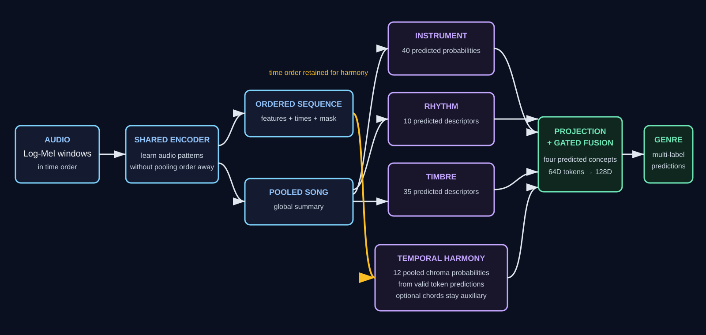

# Concept-Guided Music Genre Classification

This project is developing an inspectable, multi-label music genre classifier for
the MTG-Jamendo dataset. The proposed model learns four musical concepts from one
shared audio representation:

- instruments — what is playing;
- rhythm — the beat and tempo;
- timbre — the character of the sound;
- harmony — currently song-level tonal descriptors; temporal pitch/chord changes
  are a separate proposed experiment.

It learns how much each concept contributes, combines the four representations, and
predicts every genre that applies to a song.

<p align="center">
  
</p>

## Current state

The diagram above is an early proposed design, not the current run contract.
The repository now has a joint trainer for six genres and 41 instrument labels.
Harmony v3 predicts 12 standardized **song-level descriptors** selected from a
completed 45-feature extraction of 7,324 tracks; fusion projects those 12
predictions to 64D. A supplied joint-run report and checkpoint were audited, but
their code commit and exact harmony loss weight are not recorded. The whole-model
genre score does not yet establish harmony's added value without a matched
no-harmony comparison. Temporal chroma/chord supervision is unrun research.
See the [Harmony v3 snapshot](harmony_branch/docs/architecture-versions/v3/README.md)
and [audited handoff](harmony_branch/docs/integration-handoff.md).

See the [historical project plan](docs/project-plan.md) for prior cross-team
decisions, and the [Harmony evaluation plan](plan.md) for the completed audit.

## Documentation

Each document has one purpose:

| Document | Purpose |
|---|---|
| [Architecture](docs/architecture.md) | Historical system-level proposal; current contracts are linked at its top |
| [Shared CNN encoder](docs/shared-cnn-encoder-architecture.md) | Implemented CNN, tensor contract, temporal geometry, masks, and checkpoint compatibility |
| [Historical project plan](docs/project-plan.md) | Earlier status and proposed sequence; not a live tracker |
| [Harmony branch](harmony_branch/README.md) | Owned code, tests, documentation, and integration boundary |
| [Harmony v3 architecture](harmony_branch/docs/architecture-versions/v3/README.md) | Current diagrammed model and evidence |
| [Temporal harmony research plan](harmony_branch/docs/temporal-chroma-research-plan.md) | Optional, unrun chroma/chord experiment only |
| [Harmony integration hand-off](harmony_branch/docs/integration-handoff.md) | Current interface, required artifacts, and executable next commands |
| [Team standards](docs/team-standards.md) | Shared data, model, artifact, evaluation, and development contracts |

## Notebook workflows

Choose one runtime for the shared data path:

- [Google Colab workflow](notebooks/colab/README.md) persists artifacts in Drive.
- [Kaggle workflow](notebooks/kaggle/README.md) passes saved outputs between notebooks.

Only `00` download, `01` preprocessing, and `04` rhythm-target extraction remain.
The old numbered notebooks `02`–`03` and `05`–`09` are retired; instrument, timbre,
harmony, and fusion now live in their packages. Generator scripts write only those
three essential notebooks.

## Modal training

The joint architecture is configured for `data/vector-dataset-normalized.csv`
on a persistent Modal GPU runner. See the [Modal training guide](docs/modal-training.md)
for per-account Volume setup, data upload, smoke-test, full-run, and result-download
commands.

For an encoder-matched six-genre CNN comparison, see the
[direct CNN baseline](docs/cnn-baseline.md). Select it with `--model cnn`
in the local trainer or Modal runner.

## Repository structure

```text
.
├── README.md
├── requirements.txt
├── data/                         # ignored local datasets
├── docs/
│   ├── architecture.md
│   ├── shared-cnn-encoder-architecture.md
│   ├── project-plan.md
│   ├── team-standards.md
│   └── diagrams/
│       └── proposed-concept-guided-architecture.svg
├── notebooks/
│   ├── colab/
│   ├── kaggle/
│   └── dataset_split/
├── instrument_branch/             # instrument concepts from a 128D song input
├── timbre_branch/                  # 35 standardized timbre concepts from a 128D input
├── rhythm_branch/                  # 10 learned temporal rhythm concepts
├── harmony_branch/                 # current descriptor branch plus temporal research
├── shared_encoder/                 # modular shared CNN, geometry, validation, and types
├── concept_fusion/                # shared contracts, projections, losses, and fusion
├── scripts/
│   ├── generate_colab_notebooks.py
│   ├── generate_kaggle_notebooks.py
│   ├── shared_audio_encoder.py    # compatibility import for shared_encoder/
│   ├── freeze_experiment_cohort.py
│   ├── manage_gpu_budget.py
│   └── paired_bootstrap_compare.py
└── tests/
    └── test_*.py
```

Large audio caches and checkpoints remain outside Git. The harmony descriptor
tables and supplied run report are committed; see the [feature contract](harmony_branch/docs/feature-contract.md)
and [evidence index](harmony_branch/docs/evidence/README.md).
