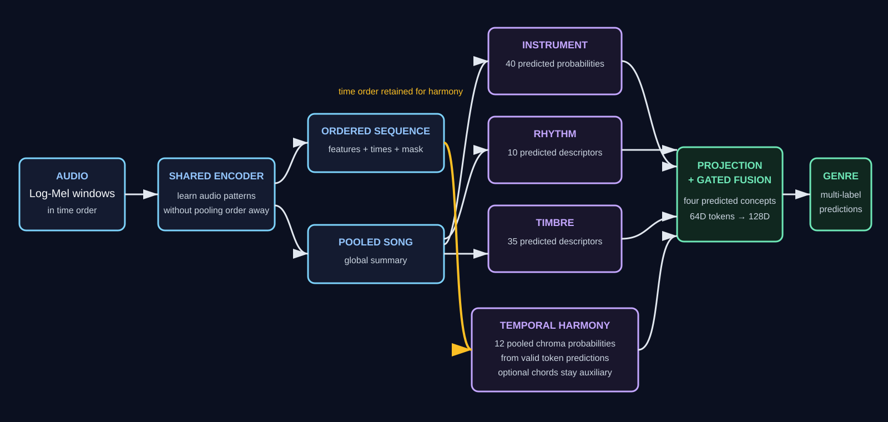

# Project architecture

This document separates comparison baselines from the proposed research model. The
[project plan](project-plan.md) records implementation status; the
[harmony plan](harmony-plan.md) owns harmony-specific decisions.

## Comparison baselines

### Baseline A: direct CNN

```text
log-Mel audio → CNN → multi-label genre predictions
```

This establishes how well a simple audio-only classifier performs.

### Instrument pretraining

A shared-window CNN and masked pooling learn an instrument representation from the
official instrument tags. This is an initialization experiment, not a complete
genre model.

### Baseline B: descriptor fusion

The descriptor baseline combines an instrument embedding with validated rhythm,
timbre, and compact harmony descriptors. It may use concatenation or attention over
projected concept tokens before predicting genres.

```text
instrument + rhythm + timbre + global tonal summary
                    ↓
          linear/attention fusion
                    ↓
             genre predictions
```

Global chroma/Tonnetz statistics are allowed here only as an explicitly named
baseline such as `global_tonal_summary_v1`. They are not the proposed temporal
harmony branch. Invalid Mel-band pitch-class proxies are forbidden.

## Proposed concept-guided model



The encoder must preserve both ordered information and an optional pooled song
summary:

```text
audio windows → shared encoder ┬→ ordered encoded sequence + mask + timestamps
                               └→ pooled song representation
```

The ordered sequence is necessary for branches that model change over time. In
particular, one vector per approximately 29-second model window is still too coarse:
it cannot preserve chord changes within that window. The shared encoder must expose
its within-window temporal feature map before time averaging, together with token
intervals and the originating window index. `scripts/shared_audio_encoder.py`
provides the CPU-tested interface while preserving the existing song-window output.

### Branch inputs and outputs

| Branch | Input | Current output sent toward fusion | Supervision |
|---|---|---:|---|
| Instrument | Pooled 128D song representation | 40 predicted instrument probabilities | Official multi-label instrument tags |
| Rhythm | Ordered shared features | 32D | Versioned tempo, onset, beat, and danceability targets |
| Timbre | Pooled 128D song representation | 35 standardized predicted descriptors | Versioned spectral and energy targets |
| Harmony | Fine-grained ordered shared features with intervals and window identity | 32D | Temporal chroma plus optional confidence-filtered chord pseudo-labels |

Embedding widths are hyperparameters, not natural constraints. Instrument and timbre
currently expose strict concept bottlenecks rather than private fusion embeddings;
fusion projects their 40D and 35D values to its common token width. The 32D rhythm
and harmony values are starting configurations only.

Every branch returns the same logical fields:

```text
embedding
predictions
availability
```

Predictions supervise and evaluate the concept branch. The embedding is the output
sent to fusion. Harmony may expose several prediction heads—temporal chroma, chord
probabilities, and optional key/mode—instead of one fixed 18-value head.

The separate fixture fusion prototype has not yet adopted that harmony interface: it
still declares 18 provisional harmony concepts and expects a 64D harmony token. That
is an integration placeholder, not a reason to collapse temporal harmony into 18
song-level means.

### Harmony supervision boundary

MTG-Jamendo has no aligned chord timelines. Chroma computed from waveform audio is a
reference feature, and automatically estimated chords are pseudo-labels. Neither is
described as human ground truth. Teacher confidence and failure masks are part of
the target contract.

The chord vocabulary starts with 12 major, 12 minor, and no-chord. A teacher must be
benchmarked on an existing annotated chord dataset before its MTG-Jamendo outputs
are accepted. If no teacher passes the agreed quality gate, the model uses temporal
chroma supervision without chord labels.

### Fusion

Raw branch outputs do not need equal widths. Fusion first projects each output to a
common width (64D in the current fixture prototype):

```text
instrument embedding ─→ projection ─┐
rhythm embedding ─────→ projection ─┤
timbre embedding ─────→ projection ─┼→ gates/attention → 128D music representation
harmony embedding ────→ projection ─┘
```

The initial fused width is 128D. Concatenation is a one-time project-level fusion
comparison, not a sweep repeated for every branch target. Gate values alone are not
feature-importance proof.

### Joint objective

```text
genre loss
+ λinstrument × instrument loss
+ λrhythm × rhythm loss
+ λtimbre × timbre loss
+ λchroma × temporal chroma loss
+ λchord × chord pseudo-label loss       # only when the teacher is accepted
+ λkey × key/mode loss                    # optional
```

Each loss has its own mask and reduction. Missing concept supervision masks only
that auxiliary loss; it does not erase a learned branch output from fusion.

## Resource-bounded comparisons

Experiments are staged rather than crossed into a full grid. Existing compatible
baseline results are reused. The minimum harmony comparison is:

1. no-harmony control;
2. one 32D temporal-chroma model;
3. one temporal-chroma-plus-chords model only if the chord teacher and standalone
   branch pass their documented gates.

Direct CNN, descriptor fusion, and no-concept-supervision results are project-level
baselines and should not be retrained solely for the harmony owner when a compatible
checkpoint and cohort already exist. Concatenation versus gated fusion is owned by
the shared-model experiment, not repeated for every harmony target.

Key-relative chords, alternate embedding widths, shuffled-label controls, and
loss-weight sensitivity are conditional diagnostics. Run at most the diagnostic
needed to resolve a specific ambiguous result; they are not a default sweep.

All comparisons use the same official split, genre vocabulary, and evaluated song
cohort. Screening uses one seed, a frozen encoder, cached ordered features, early
stopping, and a fixed development subset. Only finalists advance to full joint
training and held-out test evaluation.
