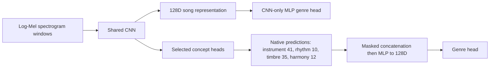

# Modular concept experiments

Run from the repository root. `--branches` selects which learned concept heads
exist in the joint run. Omit the option to retain all four branches. Use `none`
for the existing direct CNN baseline (`--model cnn` is also supported).

```powershell
python scripts/train_joint.py --branches none --seed 42 --skip-test --out-dir results/01-cnn
python scripts/train_joint.py --branches instrument --seed 42 --skip-test --out-dir results/02-instrument
python scripts/train_joint.py --branches instrument timbre --seed 42 --skip-test --out-dir results/03-instrument-timbre
python scripts/train_joint.py --branches instrument timbre rhythm --seed 42 --skip-test --out-dir results/04-instrument-timbre-rhythm
python scripts/train_joint.py --branches instrument timbre rhythm harmony --seed 42 --skip-test --out-dir results/05-all
```

Add the same data and training arguments to each command, for example
`--dataset-csv data/full_dataset.csv --epochs 30 --batch-size 1 --max-windows 16`.
`--quick` runs three epochs on up to 32 tracks per split for a smoke test.
Each command trains a fresh model. It does not continue the preceding stage.

Any subset is supported, including `--branches rhythm`, `--branches timbre harmony`,
or all branches except harmony. Names are space-separated and duplicates/unknown
names fail before training. The fusion order remains instrument, rhythm, timbre,
harmony regardless of argument order. When no output directory is supplied, the
CLI uses `results/cnn` or `results/<selected-branches>`; choose a new directory for
each seed or repeat to avoid overwriting that run.

## Prediction paths



CNN-only uses the existing 128→128→6 MLP after song pooling, with genre BCE only.
Concept runs send predicted concepts to the genre classifier without a raw CNN
bypass. The default `--fusion native_concat` concatenates selected predictions
directly, then applies `Linear(total_width,128) -> ReLU -> Dropout(0.1)` and the
genre head. Instrument, timbre, rhythm and harmony retain widths 41, 35, 10 and 12.
The ladder's input widths are 41, 76, 86 and 98; CNN-only is unchanged. There are
no per-branch projections or learned scalar gates in this mode. Harmony uses its
12 predicted descriptors, not its internal embedding.

Use `--fusion gated` to compare against the previous architecture with per-branch
64D projections and masked gates. Native concatenation is a simple way to preserve
the requested values; validation results determine which fusion performs better.
Use different output directories for fusion comparisons. Checkpoints record the
fusion name, contract version, concept widths and native fusion input dimension;
old gated checkpoints are not compatible with the new fusion weights.

Disabled heads are not instantiated or executed. Their slots in the existing
four-slot fusion contract contain zero values and zero availability/supervision
masks. Native concatenation omits their columns entirely; gated mode freezes their
projection parameters. They contribute zero auxiliary loss and no branch metrics. Concept dropout can
only remove enabled branches and retains at least one available branch.

Enabled heads retain their auxiliary supervision and loss weights:
`--lambda-instrument`, `--lambda-timbre`, `--lambda-rhythm`, `--lambda-harmony`.
A zero loss weight is different from disabling a branch: the prediction still
enters genre fusion when the branch is selected.

## Data and comparison protocol

Only selected branches require target columns/vectors or legacy target CSVs.
Disabled targets are ignored, and no scaler is fitted for them. CNN-only needs
audio paths, genre labels, split assignments and the usual audio metadata.
Enabling harmony with `--require-harmony-targets` checks its targets; that flag
is rejected when harmony is disabled.

Use identical track cohorts, frozen split assignments, audio window settings,
epoch budgets and seeds. The seed controls initialization and a separate training
shuffle generator so changing branch count does not alter shuffle order through
model-initialization RNG consumption. This does not guarantee bitwise deterministic
GPU kernels. Repeat promising configurations with several seeds.

Select architectures using validation macro AP. `--skip-test` reserves the test
split; omit it for final evaluation. Results and checkpoints record the selected
branches, seed, configuration, trainable parameter count, split track IDs and
active head states. Disabled head/scaler states are null. The selected checkpoint
also produces `validation_predictions.npz` and, when test is enabled,
`test_predictions.npz`, with probabilities, targets and track IDs for paired
comparisons. A checkpoint must be reconstructed with its recorded branch selection.

## Modal

The Modal wrapper forwards branch selection, fusion mode and seed. Its branch string accepts
commas or spaces:

```powershell
modal run modal_app.py --branches instrument,timbre --seed 42 --skip-test --run-name instrument-timbre-seed42
modal run modal_app.py --branches none --seed 42 --skip-test --run-name cnn-seed42
modal run modal_app.py --branches instrument,timbre --fusion native_concat --seed 42 --skip-test --run-name native-instrument-timbre-seed42
```

These commands submit GPU runs; local unit tests do not launch Modal training.

## Instrument + rhythm comparison

This subset is supported directly, without timbre or harmony targets. Instrument
contributes 41 probabilities and rhythm contributes 10 standardized predictions.
Concatenation feeds 51 values to `Linear(51,128) -> ReLU -> Dropout(0.1)`, followed
by the genre head `Dropout(0.1) -> Linear(128,6)`. Both branches share the same CNN:
instrument uses its masked pooled song vector, while rhythm uses its temporal
sequence. The default joint loss is genre BCE + instrument BCE + rhythm Smooth L1.

Run a small Modal smoke test first, keeping the terminal open until completion:

```powershell
modal run modal_app.py --branches instrument,rhythm --fusion native_concat --quick --batch-size 1 --max-windows 16 --gpu A10 --seed 42 --skip-test --run-name instrument-rhythm-smoke-01
```

Then submit the 30-epoch run with the same data and hyperparameters as the other
experiments:

```powershell
modal run --detach modal_app.py --background --branches instrument,rhythm --fusion native_concat --epochs 30 --batch-size 1 --max-windows 16 --gpu A10 --seed 42 --skip-test --run-name instrument-rhythm-30ep-s42
```

Wait for submitted status, a function-call ID and the local prompt to return before
closing the terminal. This starts a fresh model. Compare its validation score with
instrument-only and instrument+timbre+rhythm to assess the incremental role of each
branch. Test evaluation is reserved by `--skip-test`.
