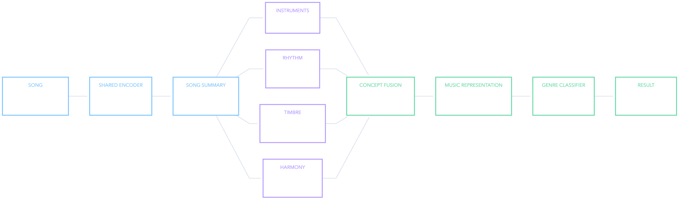

# Proposed architecture

The target model learns four concept representations from one shared neural audio encoder and trains genre prediction jointly with concept supervision.



## Model flow

1. Load up to 12 log-Mel windows per song.
2. Encode every valid window with a compact shared CNN.
3. Use masked attention to create one shared song representation.
4. Send that representation through four concept branches.
5. Fuse the four concept embeddings using learned gates.
6. Predict multi-label genre logits from the fused representation.

## Concept branches

| Branch | Initial embedding size | Supervision |
|---|---:|---|
| Instrument | 64 | Multi-label instrument tags |
| Rhythm | 32 | BPM, onset rate, danceability and beat statistics |
| Timbre | 35 | Centroid, bandwidth, contrast, flatness, roll-off, HNR, inharmonicity, and MFCC statistics |
| Harmony | 32 | 12 chroma and 6 Tonnetz targets |

Continuous targets must be fitted and standardized using training data only. Missing target values must be masked out of their auxiliary losses.

## Fusion and losses

Gated fusion learns one contribution weight for each concept and produces a 128-dimensional music representation. An availability mask is necessary only when an entire concept input is absent; missing supervision alone should mask the relevant auxiliary loss, not erase the branch output.

The training objective is:

```text
genre loss
+ λinstrument × instrument loss
+ λrhythm × rhythm loss
+ λtimbre × timbre loss
+ λharmony × harmony loss
```

Use `BCEWithLogitsLoss` for multi-label genre and instrument outputs. Start with Smooth L1 or MSE for standardized continuous targets. The loss weights are validation hyperparameters and must be reported.

## Explainability claim

Concept gates make the model inspectable, not automatically explainable. Validate them using concept removal, prediction changes, branch-target performance, and qualitative listening examples.
