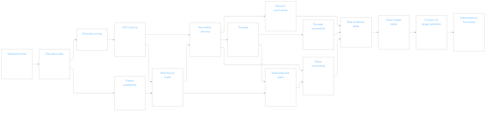
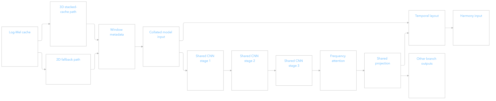
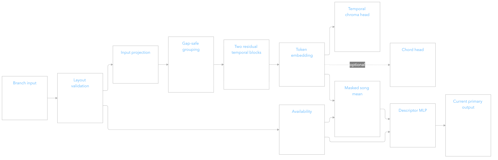
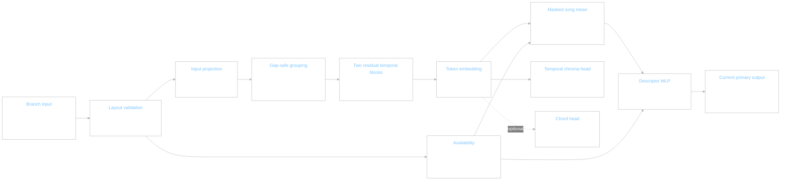
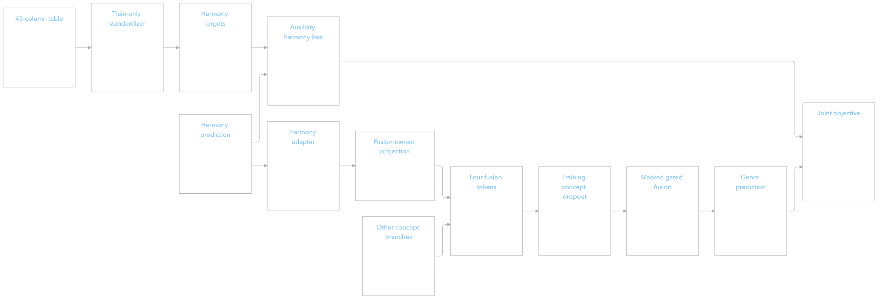
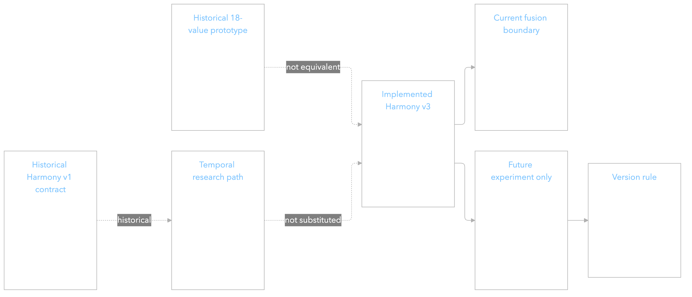
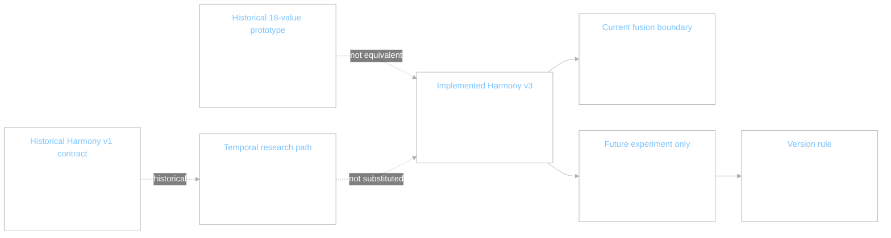

# Harmony v3 — implemented architecture snapshot

Recorded 2026-09-28 for Dehan and Thevindu. The code declares “Harmony v3” in
[`concept_fusion/contract.py`](../../../../concept_fusion/contract.py). The
inspected repository base is commit `6c6019a12ea0bfdb6139b1659ef9fd7d5de8dd0e`;
the supplied extraction notebook and this documentation were added afterward.
The **training checkpoint's code commit is not stored**, so this document does
not claim byte-for-byte reproduction of that run. Its architecture and target
metadata agree with the current code and the supplied run report.

Status: **implemented** 12-descriptor joint path. Temporal chroma/chord code is
present but **not supervised** in this run. The team decided that training audio
is under four minutes; that decision is the input policy for this snapshot.

Read the diagrams in order. Each has an editable Mermaid source immediately
below the PNG. The `.mmd` file beside each PNG is the retained source asset.

## 1. Target provenance and extraction

The extractor reads full-quality MP3s, but analyzes only the first
`min(decoded duration, 240 s)`. It uses Librosa 0.11.0, mono 16 kHz audio,
36 CQT bins per octave across seven octaves, 12 pitch classes in C-to-B order,
and a 512-sample hop. Tuning is estimated per track. The validity mask requires
RMS above `max(1e-6, 0.01 × peak RMS)` plus finite, positive chroma mass.
Consequently “valid tonal” means *usable energy/chroma*, not confirmed tonal
music. There is no harmonic/percussive separation. Chroma is L1-normalized only
on valid frames; flux and Tonnetz movement use adjacent valid pairs.

   
  
   
   

Mermaid source — target extraction

```mermaid
%%{init: {"theme":"base", "look":"classic", "fontFamily":"Avenir Next, Helvetica Neue, Arial, sans-serif", "themeVariables": {
  "primaryColor":"transparent", "primaryTextColor":"#ffffff", "primaryBorderColor":"#b0b0b0",
  "lineColor":"#b0b0b0", "textColor":"#ffffff",
  "fontFamily":"Avenir Next, Helvetica Neue, Arial, sans-serif",
  "edgeLabelBackground":"transparent", "tertiaryColor":"transparent", "clusterBkg":"transparent"
}}}%%
flowchart LR
  MAN["<span style='color:#7CC4FF'>Selected tracks</span><br/><br/>7,324 TRACK_IDs<br/>full-quality MP3 paths"]
  AUDIO["<span style='color:#7CC4FF'>Decode audio</span><br/><br/>mono, 16 kHz<br/>first min(duration, 240 s)"]
  TUNE["<span style='color:#7CC4FF'>Estimate tuning</span><br/><br/>36 bins per octave"]
  CQT["<span style='color:#7CC4FF'>CQT chroma</span><br/><br/>12 pitch classes, 7 octaves<br/>512-sample hop, no HPSS"]
  RMS["<span style='color:#7CC4FF'>Frame availability</span><br/><br/>RMS threshold: max(1e-6,<br/>1% of track peak RMS)"]
  VALID["<span style='color:#7CC4FF'>Valid frame mask</span><br/><br/>RMS passes; chroma finite<br/>and positive sum; at least 2 frames"]
  NORM["<span style='color:#7CC4FF'>Normalize chroma</span><br/><br/>L1 per valid frame<br/>12 values sum to 1"]
  TON["<span style='color:#7CC4FF'>Tonnetz</span><br/><br/>6 tonal-centroid axes<br/>from normalized chroma"]
  PAIR["<span style='color:#7CC4FF'>Valid adjacent pairs</span><br/><br/>both frames valid<br/>needed for movement and flux"]
  CHROMASTATS["<span style='color:#7CC4FF'>Chroma summaries</span><br/><br/>12 means + 12 standard deviations"]
  TONSTATS["<span style='color:#7CC4FF'>Tonnetz summaries</span><br/><br/>6 means + 6 standard deviations"]
  OTHER["<span style='color:#7CC4FF'>Other summaries</span><br/><br/>concentration 2; entropy 2<br/>flux 2; movement 2; valid ratio 1"]
  RAW["<span style='color:#7CC4FF'>Raw evidence table</span><br/><br/>45 descriptors + diagnostics<br/>7,324 OK rows"]
  CLEAN["<span style='color:#7CC4FF'>Clean target table</span><br/><br/>TRACK_ID + 45 descriptors<br/>exact column projection"]
  SELECT["<span style='color:#7CC4FF'>Current v3 target selection</span><br/><br/>12 named song descriptors<br/>not 12 chroma probabilities"]
  NOTE["<span style='color:#7CC4FF'>Interpretation boundary</span><br/><br/>automatic pseudo-labels;<br/>no human chord or note labels"]
  MAN --> AUDIO --> TUNE --> CQT --> VALID
  AUDIO --> RMS --> VALID
  CQT --> NORM --> TON
  VALID --> NORM
  VALID --> PAIR
  NORM --> CHROMASTATS
  NORM --> OTHER
  TON --> TONSTATS
  TON --> PAIR --> OTHER
  CHROMASTATS --> RAW
  TONSTATS --> RAW
  OTHER --> RAW --> CLEAN --> SELECT --> NOTE
```

The [raw CSV](../../../data/harmony_features_raw.csv) has 7,324 `ok` rows,
including 2,583 analyzed to the 240-second cap. The
[clean CSV](../../../../data/harmony_df.csv) is an exact projection of its
45 feature columns. These are automatic descriptors, not human-labeled notes,
chords, keys, or chord progressions. The exact notebook is
[`extract_harmony_features_first4min_vastai.ipynb`](../../../notebooks/extract_harmony_features_first4min_vastai.ipynb).

## 2. Model audio and shared encoder

The run report records 16 kHz, 512-hop, 128-mel, centered-STFT, and 15-second
cache metadata. The loader accepts either stacked `(windows,128,F)` arrays or
a 2D `(128,total_frames)` fallback. For stacked input it selects at most 12
ordered windows and uses the cache's actual `F`; the saved
`window_frames=1366` applies **only** to the 2D fallback. It carries valid-frame
counts and song-relative window start times, zeros padded tails, and collates
`(B,W,1,128,F)`. The actual stacked-cache frame width is not in the checkpoint.

The shared CNN handles each sampled window separately: Conv2d 1→32 with
GroupNorm/GELU and 2×2 pooling; Conv2d 32→64 with GroupNorm/GELU and 2×1
pooling; Conv2d 64→96 with GroupNorm/GELU. Frequency attention collapses the
frequency axis, then `Linear(96,128)` yields ordered 128D tokens. Temporal
stride is two log-Mel frames (64 ms at this cache's 16 kHz/512 geometry), with
a 12-frame receptive field. For padded window width `F`, the flat sequence has
`T = W × ceil(F/2)` positions; only `ceil(valid_frames/2)` per window are
marked valid. The layout retains song times and window identity. The trainer
passes cache sample rate/hop to the encoder rather than relying on its older
default values.

   
  
   
   

Mermaid source — audio and shared encoder

```mermaid
%%{init: {"theme":"base", "look":"classic", "fontFamily":"Avenir Next, Helvetica Neue, Arial, sans-serif", "themeVariables": {
  "primaryColor":"transparent", "primaryTextColor":"#ffffff", "primaryBorderColor":"#b0b0b0",
  "lineColor":"#b0b0b0", "textColor":"#ffffff",
  "fontFamily":"Avenir Next, Helvetica Neue, Arial, sans-serif",
  "edgeLabelBackground":"transparent", "tertiaryColor":"transparent", "clusterBkg":"transparent"
}}}%%
flowchart LR
  CACHE["<span style='color:#7CC4FF'>Log-Mel cache</span><br/><br/>16 kHz, hop 512, 128 mel<br/>15 s cache metadata, center true"]
  THREE["<span style='color:#7CC4FF'>3D stacked-cache path</span><br/><br/>windows x 128 x actual F<br/>select up to 16 ordered windows"]
  TWO["<span style='color:#7CC4FF'>2D fallback path</span><br/><br/>128 x total frames<br/>chunk by saved window_frames=1366"]
  META["<span style='color:#7CC4FF'>Window metadata</span><br/><br/>valid frame counts, start times<br/>invalid tail zeroed"]
  BATCH["<span style='color:#7CC4FF'>Collated model input</span><br/><br/>mel (B,W,1,128,F)<br/>window mask (B,W)"]
  CNN1["<span style='color:#7CC4FF'>Shared CNN stage 1</span><br/><br/>Conv2d 1 to 32, GN, GELU<br/>pool frequency 2, time 2"]
  CNN2["<span style='color:#7CC4FF'>Shared CNN stage 2</span><br/><br/>Conv2d 32 to 64, GN, GELU<br/>pool frequency 2, time 1"]
  CNN3["<span style='color:#7CC4FF'>Shared CNN stage 3</span><br/><br/>Conv2d 64 to 96, GN, GELU"]
  FREQ["<span style='color:#7CC4FF'>Frequency attention</span><br/><br/>softmax over frequency<br/>weighted 96-channel sum"]
  PROJ["<span style='color:#7CC4FF'>Shared projection</span><br/><br/>Linear 96 to 128<br/>ordered tokens per window"]
  LAYOUT["<span style='color:#7CC4FF'>Temporal layout</span><br/><br/>stride 2 frames; valid mask<br/>song times + window identity"]
  SEQ["<span style='color:#7CC4FF'>Harmony input</span><br/><br/>sequence (B,T,128)<br/>mask (B,T), index (B,T)"]
  OTHER["<span style='color:#7CC4FF'>Other branch outputs</span><br/><br/>pooled song (B,128)<br/>window representation (B,W,128)"]
  CACHE --> THREE --> META
  CACHE --> TWO --> META
  META --> BATCH --> CNN1 --> CNN2 --> CNN3 --> FREQ --> PROJ
  BATCH --> LAYOUT
  PROJ --> LAYOUT --> SEQ
  PROJ --> OTHER
```

## 3. Harmony branch internals and inactive heads

The branch validates `(B,T,128)` tokens, `(B,T)` mask, and window indices,
including `-1` for invalid positions. It projects 128→64, applies two residual
Conv1d blocks (kernel 3, GELU, dropout 0.1) **within each window**, then
projects each token 64→32. This prevents a temporal convolution from treating
separated sampled windows as continuous music. Invalid tokens are zeroed.

A masked mean gives a 32D song embedding. The active descriptor MLP is
`Linear(32,32) → GELU → Dropout(0.1) → Linear(32,12)`. Its output is 12
unbounded standardized values, not a probability distribution. The temporal
chroma head also computes `(B,T,12)` logits, but no temporal-chroma target is
provided by the current trainer. `chord_classes=None` disables the optional
25-class chord head. Availability is `any(valid token)`; unavailable songs have
zeroed embedding and descriptor values.

   
  
   
   

Mermaid source — harmony branch internals

The current target vector is fixed by `HARMONY_FEATURES`, in this exact order:

| Position | Descriptor | Meaning of the automatic measurement |
|---:|---|---|
| 1 | `tonal_concentration_mean` | Average strength of the largest normalized pitch-class bin |
| 2 | `tonal_concentration_std` | Variation in that largest-bin strength |
| 3 | `chroma_entropy_mean` | Average spread/uncertainty across pitch classes |
| 4 | `chroma_entropy_std` | Variation in chroma spread |
| 5 | `chroma_flux_mean` | Average adjacent-frame chroma change |
| 6 | `chroma_flux_std` | Variation in chroma change |
| 7 | `tonnetz_movement_mean` | Average adjacent-frame tonal-centroid movement |
| 8 | `tonnetz_movement_std` | Variation in that movement |
| 9 | `valid_tonal_ratio` | Fraction passing the energy/chroma-availability mask |
| 10 | `tonnetz_01_mean` | Mean of Tonnetz coordinate 1 |
| 11 | `tonnetz_02_mean` | Mean of Tonnetz coordinate 2 |
| 12 | `tonnetz_03_mean` | Mean of Tonnetz coordinate 3 |

## 4. Supervision, fusion, and genre output

The trainer joins by `TRACK_ID` and split, selects the 12 columns, and fits
per-feature mean/scale on **training rows only**. Validation and test receive
the frozen transform. The descriptor prediction and standardized target both
have shape `(B,12)`; the supervision mask is per value. Harmony auxiliary loss
is Smooth L1 averaged over observed elements. Its exact coefficient in the
supplied run is unknown: the current script defaults to 0.5, but neither
`results.json` nor `best.pt` records the historical command-line override.

The adapter sets `concept_values` to the **prediction**, not the target and not
masked-mean chroma. The harmony fusion mask reflects audio availability, not
whether a pseudo-label was observed. Fusion owns `Linear(12,64)`; the parameter
name `harmony_chroma_projection` is historical. The four token order is
instrument, rhythm, timbre, harmony; each token is 64D. Training applies
concept dropout with `p=0.15`, restoring one originally available branch if
all would be dropped. Masked gated fusion LayerNorms tokens, masks unavailable
gate logits, softmaxes the remaining gates, pools to 64D, maps to 128D, and
produces six genre logits. Genre training uses BCE with logits. The model has
no direct audio-to-genre shortcut in this primary route.

   
  
   
   

Mermaid source — supervision and fusion

```mermaid
%%{init: {"theme":"base", "look":"classic", "fontFamily":"Avenir Next, Helvetica Neue, Arial, sans-serif", "themeVariables": {
  "primaryColor":"transparent", "primaryTextColor":"#ffffff", "primaryBorderColor":"#b0b0b0",
  "lineColor":"#b0b0b0", "textColor":"#ffffff",
  "fontFamily":"Avenir Next, Helvetica Neue, Arial, sans-serif",
  "edgeLabelBackground":"transparent", "tertiaryColor":"transparent", "clusterBkg":"transparent"
}}}%%
flowchart LR
  CSV["<span style='color:#7CC4FF'>45-column table</span><br/><br/>select fixed 12 columns<br/>join on TRACK_ID + split"]
  STD["<span style='color:#7CC4FF'>Train-only standardizer</span><br/><br/>mean and scale fitted on train<br/>transform val and test unchanged"]
  TARGET["<span style='color:#7CC4FF'>Harmony targets</span><br/><br/>standardized (B,12)<br/>finite-value supervision mask"]
  PRED["<span style='color:#7CC4FF'>Harmony prediction</span><br/><br/>descriptor head (B,12)<br/>predicted values, not GT"]
  HLOSS["<span style='color:#7CC4FF'>Auxiliary harmony loss</span><br/><br/>masked Smooth L1<br/>average observed elements only"]
  ADAPT["<span style='color:#7CC4FF'>Harmony adapter</span><br/><br/>concept_values = prediction<br/>fusion mask = audio availability"]
  HPROJ["<span style='color:#7CC4FF'>Fusion-owned projection</span><br/><br/>Linear 12 to 64<br/>historical name: chroma_projection"]
  OTHERS["<span style='color:#7CC4FF'>Other concept branches</span><br/><br/>instrument 41; rhythm 10<br/>timbre 35; each to 64"]
  TOKENS["<span style='color:#7CC4FF'>Four fusion tokens</span><br/><br/>(B,4,64), fixed branch order<br/>instrument, rhythm, timbre, harmony"]
  DROP["<span style='color:#7CC4FF'>Training concept dropout</span><br/><br/>p = 0.15 per enabled branch<br/>restore one if all dropped"]
  GATE["<span style='color:#7CC4FF'>Masked gated fusion</span><br/><br/>LayerNorm; masked softmax gates<br/>weighted sum, Linear 64 to 128"]
  GENRE["<span style='color:#7CC4FF'>Genre prediction</span><br/><br/>6 logits; sigmoid for metrics<br/>genre BCE-with-logits loss"]
  TOTAL["<span style='color:#7CC4FF'>Joint objective</span><br/><br/>genre + weighted branch losses<br/>historical harmony weight unknown"]
  CSV --> STD --> TARGET --> HLOSS
  PRED --> HLOSS
  PRED --> ADAPT --> HPROJ --> TOKENS
  OTHERS --> TOKENS --> DROP --> GATE --> GENRE --> TOTAL
  HLOSS --> TOTAL
```

## 5. Version boundaries and evidence

The old 18-value prototype and the older Harmony v1 ADR are **historical**.
The temporal-chroma/chord path is a separate **proposed experiment**, even
though its chroma output also has width 12. It cannot replace v3's 12
standardized song descriptors without changing the target, loss, evaluation,
and fusion interpretation. The 32D embedding-to-64D route remains an ablation;
the active fusion input is the 12 descriptor predictions.

   
  
   
   

Mermaid source — version boundaries

### Checkpoint and report anchors

The supplied `best.pt` checkpoint is not committed to Git. Its SHA-256 is
`7916839945e30ca9b4c2d5d6796a9989e1950313b0e5546a4ef8180440e46761`.
Its metadata confirms epoch 20, validation genre macro AP 0.765960, harmony
supervision enabled, exact target order above, the descriptor-regression
strategy, and the cache/window settings stated in section 2. The supplied
[`harmony_supervised_joint_run_results.json`](../../evidence/harmony_supervised_joint_run_results.json)
confirms 5,127/1,099/1,098 train/validation/test tracks; harmony test macro
R² 0.4704 and standardized MAE 0.4791; genre test macro AP 0.7356. The
three selected Tonnetz mean coordinates have test R² 0.072, 0.044, and
-0.004, but nonzero train-set standard deviations of about 0.1324, 0.1256,
and 0.0822. These metrics do not establish that a deeper harmony model is
needed or that harmony improved genre prediction. A matched no-harmony
ablation is required for the latter claim.

### Evidence limits and next-version gate

The notebook/CSV schema and values are internally consistent, but individual
features were not re-extracted from source MP3s in this audit. The supplied
checkpoint does not store a code commit or the exact harmony loss coefficient.
No manual annotation is required for this baseline. A proposed temporal
chroma/chord version must first establish aligned pseudo-target quality and
benchmark the teacher; it must not inherit v3's metrics as if they measured
the same task. See the [team handoff](../../integration-handoff.md) and
[version register](../README.md) for the decision and change policy.
