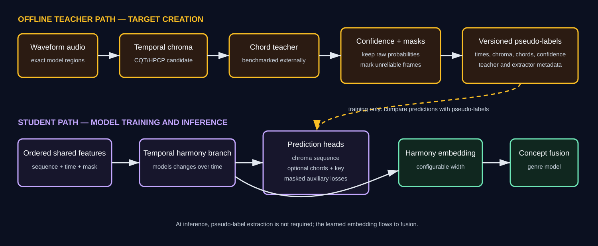

# Harmony branch implementation plan

> **Status update (2026-09-25):** This is the legacy temporal chroma/chord research
> plan. The current baseline feature extraction is complete: 7,324 selected tracks,
> first `min(duration, 240 s)`, and 45 finite track-level harmony descriptors per
> track. See [feature-contract.md](feature-contract.md). Statements below that full
> extraction is unapproved, unavailable, or limited to an 18-value candidate apply
> only to the temporal experiment and no longer describe the descriptor dataset.

## Decision and scope

The harmony branch is a **pseudo-supervised temporal concept branch**. It should
learn pitch-class activity, chord changes, and tonal movement that may help genre
classification. MTG-Jamendo has no aligned human chord timelines, and this project
will not create manual annotations. Automatically extracted harmony information is
therefore called a **reference feature** or **pseudo-label**, never ground truth.

The earlier 18-value summary is superseded for the current descriptor baseline by
the frozen 45-feature contract. The 32-dimensional embedding and temporal heads
remain candidate architectural hyperparameters for the separate temporal path.

The branch owns:

- waveform-based temporal tonal features and their timestamps;
- selection and validation of an automatic chord-label teacher;
- confidence-filtered chord pseudo-labels and masks;
- a temporal branch that predicts harmony targets and returns a song embedding;
- standalone evaluation, artifacts, tests, and integration support.

It does not own the shared waveform manifest, the shared encoder, fusion, or the
final genre evaluation. Those interfaces must be agreed with their owners.



### Current gate status

The completed descriptor baseline has a separate status from the legacy temporal
gates below:

| Descriptor gate | Status | Evidence |
|---|---|---|
| First-four-minute waveform mapping | Complete | 7,324 selected IDs resolved and processed |
| CQT-chroma descriptor extraction | Complete | `harmony_branch/data/harmony_features_raw.csv` |
| Clean 45-D training table | Complete | `data/harmony_df.csv` |
| Coverage and finite-value audit | Passed | 7,324 unique rows, 45 features, no missing/non-finite cells |

The following table applies only to the optional temporal chroma/chord experiment.

| Gate | Status | Evidence / next action |
|---|---|---|
| Research ladder | Documented | Obtain team review before registering GPU runs |
| Waveform mapping | External input required | Obtain the canonical manifest with unique `audio_path` and `waveform_available` fields; a clean hosted report and decode checks are still required |
| CQT chroma candidate | Code present | `harmony_branch/src/harmony_branch/features.py`; shared deterministic synthetic CPU gate passes |
| HPCP comparison candidate | Code present | Pinned Essentia HPCP plus harmonic separation passes the same synthetic gate |
| Chroma selection | Not selected | Run the registered 8/2-song, two-region CPU comparison; then apply the immutable pre-registered decision gate |
| Chord teacher | Baseline runner ready | Bounded CPU Essentia estimate generation, evaluator, leakage checks, and pre-registered decision gate are tested; the real external benchmark has not run |
| Chord-teacher integration | Ready | A three-track CPU fixture executes frozen mapping, policy registration, Essentia inference, `mir_eval`, and teacher selection without CUDA |
| Chroma target pilot | Gate ready | The immutable writer is tested but refuses to run until the real extractor decision passes |
| Temporal encoder interface | Code present | Fine within-window tokens, intervals, masks, gaps, gradients, and both instrument-checkpoint layouts pass CPU tests; hosted integration remains |
| Frozen-feature cache | Gate ready | Immutable CPU-only exporter is capped and tested; it requires a validated instrument checkpoint and frozen train/validation cohort |
| Screening dataset join | Gate ready | Hash-checked feature/target join, per-split coverage, and 100 ms anti-coarsening contract pass CPU tests; awaits real pilot artifacts |
| Temporal branch module | Code present | Lightweight reference temporal convolution, configurable embedding/chord head, masking, losses, gradients, and checkpoint restore pass CPU tests; no empirical architecture claim yet |
| Frozen branch screen | Gate ready | One fixed CPU run plus preregistered decision is exposed through the harmony CPU scripts; no real report exists yet |
| Cheap-ladder integration | Ready | A two-song synthetic test executes real region export, extractor selection, target generation, encoder cache, alignment, one-epoch screen, and decision without CUDA |
| Full pseudo-label generation | Not approved | Wait for all preceding gates; do not process all MTG-Jamendo audio yet |

Both implementations remain candidates, not accepted target generators. Raw HPCP
failed the percussion test by producing falsely concentrated pitch output; harmonic
separation corrected that failure and is therefore part of the HPCP candidate.
The one-file extractor and capped comparison runner deliberately provide no
full-dataset mode. The shared tests cover notes, major/minor chords, a progression,
transposition, detuning, silence, percussion, short clips, corrupted arrays,
timestamps, masks, and deterministic reruns:

```bash
uv run --with-requirements harmony_branch/requirements.txt \
  python -m pytest harmony_branch/tests/test_harmony_chroma.py -v
```

Freeze a small development list from the canonical manifest before looking at
candidate outputs:

```bash
python scripts/freeze_experiment_cohort.py dataset/song_manifest.csv \
  --splits train validation \
  --require-available waveform_available \
  --limit train=8 --limit validation=2 \
  --seed 42 \
  --output results/cohorts/harmony_extractor_seed42.json
```

The 8/2 split is deliberately small. It provides more song diversity than spending
the same cap on two whole songs. Resolve each ID to two deterministic, evenly spaced
model-input windows before extraction:

```bash
python harmony_branch/scripts/export_harmony_regions.py \
  dataset/song_manifest.csv \
  results/cohorts/harmony_extractor_seed42.json \
  --root <MTG-root> \
  --regions-per-song 2 \
  --output results/cohorts/harmony_regions_seed42.json
```

The exporter refuses more than 32 songs, rejects test IDs by default, checks the
manifest and cohort hashes, requires unique existing waveform and log-Mel paths,
and derives region boundaries from the same window-selection function used by the
model. With ten songs and two approximately 29.1-second windows per song, the
registered request remains below the 600-second cap. Pass the artifact itself to the
comparison runner:

```bash
uv run --with-requirements harmony_branch/requirements.txt \
  python harmony_branch/scripts/benchmark_harmony_extractors.py \
  --regions results/cohorts/harmony_regions_seed42.json \
  --output results/evaluations/harmony_extractor_candidates.json
```

The runner sums requested region durations and refuses the job before decoding if it
would exceed 32 songs, 384 regions, or 600 seconds. These are hard ceilings: command
options may lower them but cannot raise them. The registered comparison is frozen at
22,050 Hz. It decodes only registered regions, rejects test songs, hashes the
alignment artifact and source waveforms, and still makes no automatic extractor
choice.

Apply the pre-registered decision gate without changing its defaults after seeing
the report:

```bash
python harmony_branch/scripts/decide_harmony_extractor.py \
  results/evaluations/harmony_extractor_candidates.json \
  --output results/evaluations/harmony_extractor_decision.json
```

The gate independently rechecks the sample rate, hard ceilings, declared limits,
measured counts, and source hashes before considering either candidate. Both
candidates require zero extraction failures, at least 5% valid tonal frames,
and valid timing/runtime output. Nearest valid frames are aligned by timestamp before
their chroma cosine agreement is averaged; the comparison never reduces a region to
one global vector and therefore cannot hide temporal disagreement. Mean temporal
alignment must cover at least 90% of the smaller candidate's valid-frame count, and
mean temporal agreement must be at least 0.75. Agreement is a consistency check,
not accuracy. When both pass, CQT is chosen
for its simpler dependency path only if it is no more than 2× slower than HPCP and
its valid-frame coverage is no more than 0.10 lower. HPCP is an automatic fallback
only when CQT fails a quality gate. Disagreement or a material CQT disadvantage
produces `stop`, not another data expansion or GPU run; the methods must be reviewed.

## What the branch should represent

| Level | Meaning | Initial treatment |
|---|---|---|
| Pitch class | Relative activity of C through B regardless of octave | Temporal soft chroma/HPCP reference features |
| Tonality | Key, mode, and confidence that a segment is tonal | Optional pseudo-label head after validation |
| Chords | Major, minor, or no-chord state over time | Confidence-filtered teacher pseudo-labels |
| Progression | Order, duration, and changes of chords | Learned from the ordered sequence; summarized for diagnostics |

Tonnetz is derived from chroma. It may be useful for describing tonal movement, but
it is not automatically an independent target. Chroma-only and chroma-plus-Tonnetz
must be compared before Tonnetz becomes part of the final contract.

The initial chord vocabulary should remain deliberately small: 12 major chords, 12
minor chords, and one no-chord class. Extensions, inversions, and more chord types
are deferred until the basic teacher is reliable.

## Non-negotiable design rules

- Never derive pitch classes by splitting Mel bins into 12 frequency bands.
- Never replace unavailable waveform audio with invented zero or proxy targets.
- Preserve timestamps and ordering; a song-wide average is only a baseline.
- Align pseudo-labels with the exact audio regions presented to the model.
- Store teacher identity, version, settings, confidence, and failure reasons.
- Mask low-confidence, silent, unpitched, and unsupported regions.
- Keep raw teacher outputs so thresholds can change without re-running extraction.
- Do not use genre labels to generate harmony pseudo-labels.
- Report pseudo-label coverage by split and genre so filtering bias is visible.
- Treat gate or attention weights as inspection signals, not causal explanations.

## Target artifact contract to freeze

The exact storage format is decided in Step 4, but it must logically provide:

```text
song_id
split
audio_region_start_seconds
audio_region_end_seconds
frame_times_seconds[T]
chroma[T, 12]
chroma_valid[T]
chord_probabilities[T, 25]     # preferred when the teacher exposes probabilities
chord_labels[T]                # optional hard labels
chord_confidence[T]
chord_valid[T]
key_probabilities[25]          # optional: 12 major + 12 minor + unknown
teacher_name
teacher_version
extractor_version
schema_version
failure_reason
```

Candidate chroma artifacts use the fixed order `C, C#, D, D#, E, F, F#, G, G#,
A, A#, B`; Essentia's native A-first HPCP is rotated before comparison. Valid
frames are L1-normalized and silent/unpitched frames are zero with a separate false
mask. Maximum chroma-bin concentration is only a diagnostic and must not be called a
calibrated confidence score. The selected extractor must freeze whether timestamps
denote frame starts or centers before target generation.

Large temporal arrays should use NPZ, Zarr, HDF5, or another reviewed array format;
CSV is reserved for the index, metadata, and compact song summaries. One row of 18
means is not the canonical temporal artifact.

## Implementation sequence

### Compute policy

GPU time is reserved for decisions that cannot be answered with cached features or
CPU analysis. The project must not run every combination of target, embedding width,
loss weight, fusion method, and seed.

| Stage | Data/model policy | GPU policy | Output |
|---|---|---|---|
| Extractor checks | Synthetic fixtures plus one fixed development subset | CPU only | Select one chroma extractor |
| Chord-teacher bake-off | Existing annotated benchmark plus the same development subset | CPU first; brief batched inference only if a teacher requires GPU | Select or reject one teacher |
| Pseudo-label generation | Run the selected teacher once and cache immutable outputs | Prefer CPU; one batched pass if GPU is required | Reusable target artifacts |
| Branch screening | Frozen shared encoder and cached ordered features on a fixed train/validation development subset | One seed, early stopping, short cap | Reject weak variants cheaply |
| Joint training | Full training data for variants that passed screening | Only the minimum comparison set | Final validation candidates |
| Final evaluation | Selected configuration only | No tuning on test | One held-out test result |

Every run must record estimated and actual GPU time, configuration, checkpoint, and
decision. Failed or clearly inferior variants stop at their current gate. Cached
pseudo-labels, encoded sequences, splits, and metrics are reused across variants.
Changing one factor at a time is preferred over a Cartesian hyperparameter sweep.
GPU notebooks use early stopping and a default 120-minute total wall-time cap.
Training checks the deadline between batches and stops at 90% of the allowance so
validation, export, and runtime bookkeeping have reserved time. Test evaluation remains disabled during development and is enabled
only once for the validation-selected finalist.

Before starting a GPU job, its run record must answer:

```text
question being answered
cheaper checks already completed
hashed evidence artifact for every cheaper check
checkpoint/features/targets being reused
single configuration difference from the control
comparison ID, control run ID, and hashed control predictions
maximum epoch or wall-time cap
validation metric and advance threshold
artifact destination
```

For branch screening and joint training, a candidate cannot reserve or start GPU
time with a missing or changed control, a template placeholder, or a zero
practical-effect threshold. Reservation also fails when a declared CPU-gate report
or reused artifact is missing or has changed; the runtime rechecks hashes for gate
evidence, cached features/checkpoints/targets, and control predictions before
enabling CUDA.

Each configuration has one stable experiment ID. A second attempt is the absolute
maximum and requires a different run ID, the first run ID, a written reason, and a
hashed ambiguity/failure report. Merely renaming the run cannot bypass this limit.

Create the record from the executable template and validate it before uploading it
to Colab or Kaggle:

```bash
python scripts/validate_gpu_run_request.py --print-template
python scripts/manage_gpu_budget.py reserve results/gpu_budget.json \
  --run-record path/to/H1.json
python scripts/validate_gpu_run_request.py path/to/H1.json \
  --expected-job harmony_branch_screening
```

Validation must pass with status `approved`; `--allow-planned` is only for drafting.
The approved `code_commit` must be a real Git hash, its estimate must have a matching
reservation in the shared GPU ledger, and the frozen cohort file must
exist beside the uploaded record (or at the recorded path). Set `GPU_RUN_RECORD` in
the hosted runtime only after these conditions hold. The notebook will refuse CUDA
otherwise and will save the record in its checkpoint and runtime ledger.

If those fields are missing, the run is not approved. The default joint run IDs are
`H0_no_harmony` (reuse if compatible), `H1_temporal_chroma`, and conditional
`H2_temporal_chroma_chords`. New variants require a written reason tied to an
ambiguous result from those runs.

### Advance and stop rules

Use saved validation predictions for paired CPU-side analysis before approving more
GPU work. Resample the same validation song IDs and recompute the agreed primary
genre metric for each candidate/control pair. The comparison must report the metric
difference and a paired bootstrap confidence interval.

| Gate | Advance | Stop |
|---|---|---|
| Chroma extractor | Passes deterministic musical fixtures, finite/range checks, alignment checks, and the runtime cap | Any correctness failure or no practical runtime advantage over the simpler valid candidate |
| Chord teacher | Beats the simple teacher on the existing annotated benchmark with acceptable no-chord behaviour and confidence coverage | Fails the agreed benchmark threshold or produces strongly genre-skewed coverage |
| Frozen branch | Beats constant/training-mean baselines and is stable under masks and transposition tests | Fails concept metrics, coverage, or stability checks |
| `H1` versus `H0` | Primary validation genre metric improves and the paired interval supports a real benefit | Clear degradation or no practically useful improvement |
| `H2` versus `H1` | Chords add validation benefit beyond temporal chroma | No added benefit; keep `H1` and stop chord experiments |

Freeze the primary metric, practical-improvement threshold, confidence level, and
bootstrap seed before `H1` starts. Do not choose them after seeing the comparison.
If a paired interval is ambiguous, spend the next available GPU run on one repeat of
the relevant pair—not on a new architecture or a broad sweep. If that repeat remains
ambiguous, report uncertainty and stop.

Use the CPU-only comparison utility after saving compatible validation artifacts:

```bash
python scripts/paired_bootstrap_compare.py \
  --control results/predictions/H0_validation.npz \
  --candidate results/predictions/H1_validation.npz \
  --comparison-id H1_vs_H0_temporal_chroma_v1 \
  --control-run-id H0_no_harmony_seed42 \
  --candidate-run-id H1_temporal_chroma_seed42 \
  --metric macro_pr_auc \
  --min-effect <pre-registered-value> \
  --confidence <pre-registered-value> \
  --seed <pre-registered-seed> \
  --output results/evaluations/H1_vs_H0.json
```

The tool refuses mismatched song cohorts, label orders, or targets and excludes
undefined labels from macro metrics.

### Step 1 — Freeze the research question and comparison ladder

Write down the hypotheses before choosing a teacher. They are evaluated in order,
and later questions are conditional on earlier evidence:

1. Does any harmony supervision improve genre prediction?
2. If harmony helps, does temporal chroma improve on the cheap global summary?
3. If the chord teacher is reliable, do chord pseudo-labels add value beyond chroma?
4. Only if chords help, is a key-relative representation worth testing?

The comparison ladder is sequential, not a list of variants to run in parallel:

```text
no harmony
→ global tonal-summary baseline
→ temporal chroma
→ temporal chroma + chord pseudo-labels
→ optional key-relative chord representation
```

The pre-registered primary downstream metric is macro PR-AUC. Before `H1`, the team
must still enter the practical minimum effect, total remaining GPU-hour budget, and
the named approver in the run record; those values are intentionally not invented in
this document.

**Exit criterion:** The hypotheses, metric, practical-effect threshold, compute
budget, and permitted teacher dependencies are reviewed by the team.

### Step 2 — Validate waveform and alignment inputs

Consume the canonical manifest. Verify song IDs, split membership, paths, decoding,
duration, channel conversion, and the exact regions used by the shared model. Do not
default to the first 60 seconds unless that is also the frozen model-input policy.

Produce an availability report instead of target values when audio is missing. The
canonical data workflow must provide `waveform_available` and a unique resolved
`audio_path`; the harmony scripts reject missing or ambiguous inputs rather than
inventing targets. Waveform existence is not the same as an accepted harmony target.
After freezing a small cohort, use
`harmony_branch/scripts/export_harmony_regions.py` to publish the exact ordered log-Mel frame and
time intervals consumed by the model. Do not use `--allow-test` during development.

**Exit criterion:** A deterministic manifest-to-audio-region mapping with no silent
fallbacks, exact model-window alignment, and documented coverage.

### Step 3 — Build temporal chroma candidates

Evaluate at most two justified candidates—initially CQT chroma and HPCP—on waveform
audio. Candidate pipelines may include tuning correction and harmonic/percussive
separation, but none is accepted
only because a library provides it. Preserve frame-level or beat-synchronous output
and timestamps.

Run the comparison on CPU using generated single notes, major/minor chords, progressions,
transposition, detuning, silence, percussion, short clips, and corrupted files.
Use one fixed, small development subset for runtime and numerical comparisons. Do
not extract every candidate over the complete dataset.

**Exit criterion:** One versioned chroma extractor selected using deterministic tests,
numerical checks, runtime, and representative real-audio inspection that does not
create new manual labels.

### Step 4 — Compare automatic chord teachers

Evaluate one simple signal-processing baseline and at most one credible pretrained
neural chord recognizer. Essentia/AcousticBrainz output may be
a baseline, but it is not trusted automatically. Compare teachers on an existing
human-annotated chord benchmark such as Isophonics or Billboard; using an existing
benchmark does not require this project to annotate MTG-Jamendo.

Record weighted chord accuracy, vocabulary mapping, no-chord behaviour, per-class
errors, runtime, and dependency/licensing constraints. If two viable teachers are
available, measure agreement and consider masking disagreement.

Benchmark on CPU first. If the neural teacher requires a GPU, use a short capped run
to confirm throughput and correctness before processing all songs. Run the selected
teacher over MTG-Jamendo once; do not regenerate pseudo-labels for every downstream
experiment.

**Exit criterion:** A documented teacher choice and confidence policy. If no teacher
meets the agreed threshold, ship temporal chroma without chord pseudo-supervision.

No project member creates chord annotations. Use the existing benchmark's human
reference `.lab` files and each teacher's separately generated `.lab` estimates.
The repository now provides one fixed, signal-processing baseline generator. It is
CPU-only and hard-capped at 64 pre-registered tracks, 3,600 seconds of audio, and
900 seconds of wall time. These are safety ceilings, not targets: register the
smallest representative benchmark cohort that covers major, minor, and no-chord.
Do not enlarge the cohort after looking at scores.

Before inference, create a small `mapping.csv` with the columns
`track_id,audio,reference`, using only the preselected existing benchmark cohort.
Then freeze it without manually calculating hashes:

```bash
uv run --with-requirements harmony_branch/requirements.txt \
  python harmony_branch/scripts/prepare_chord_benchmark_source.py \
  results/chord-benchmarks/mapping.csv \
  --root <benchmark-root> \
  --benchmark-name "<benchmark and version>" \
  --benchmark-source "<dataset URL or citation>" \
  --benchmark-license "<annotation license>" \
  --output results/chord-benchmarks/source-manifest.json
```

The command refuses duplicate IDs, missing files, more than 64 tracks, more than
3,600 seconds of audio, or an existing output. Hashes freeze both audio and the
existing annotations; the generator uses the annotation only as an opaque file to
verify its hash and carry its path forward. It never reads chord labels during
inference. The resulting source manifest has this shape:

```json
{
  "schema_version": "chord_teacher_source_v1",
  "benchmark": {
    "name": "<benchmark name>",
    "source": "<dataset/version URL or citation>",
    "license": "<benchmark annotation license>"
  },
  "tracks": [{
    "track_id": "<benchmark ID>",
    "audio": "audio/<id>.wav",
    "audio_sha256": "<64 lowercase hex characters>",
    "reference": "references/<id>.lab",
    "reference_sha256": "<64 lowercase hex characters>"
  }]
}
```

Before running inference, generate the policy template from that exact frozen source
manifest. This pins the benchmark name, every track ID, every reference hash, and
the complete source-manifest hash before any score is visible:

```bash
uv run --with-requirements harmony_branch/requirements.txt \
  python harmony_branch/scripts/decide_chord_teacher.py \
  --print-policy-template \
  --source-manifest results/chord-benchmarks/source-manifest.json \
  > results/chord-benchmarks/teacher-policy.template.json
```

Copy the template to the final policy path and replace every remaining placeholder
and `null` threshold with reviewed values. Keep only the Essentia simple candidate
unless one specific alternative has already been approved. Store the final policy
before teacher inference; changing the source cohort afterward makes its reports
ineligible.

Run the single baseline once:

```bash
CUDA_VISIBLE_DEVICES="" uv run --with-requirements harmony_branch/requirements.txt \
  python harmony_branch/scripts/generate_essentia_chord_estimates.py \
  results/chord-benchmarks/source-manifest.json \
  --output-dir results/chord-benchmarks/essentia-baseline
```

The runner uses the pinned HPCP implementation with a 2,048-sample frame and
1,024-sample hop, satisfying `ChordsDetection`'s documented requirement that the
HPCP frame size equal twice its hop size. It maps invalid/silent frames to `N` and
writes immutable estimates, exact input/output hashes, runtime, and diagnostics.
Essentia's strength is not a calibrated
probability, so this baseline declares `confidence: none`. The generated evaluator
manifest has this shape:

```json
{
  "schema_version": "chord_teacher_benchmark_v1",
  "benchmark": {
    "name": "<benchmark name>",
    "source": "<dataset/version URL or citation>",
    "license": "<benchmark annotation license>"
  },
  "teacher": {
    "name": "essentia_chords_detection_hpcp",
    "version": "2.1b6.dev1389",
    "settings": {"vocabulary": "12_major_12_minor_no_chord"},
    "license": "AGPL-3.0",
    "runtime_seconds": 1.0,
    "device": "cpu",
    "confidence": "none"
  },
  "tracks": [
    {
      "track_id": "<benchmark ID>",
      "reference": "references/<id>.lab",
      "estimate": "teacher-output/<id>.lab"
    }
  ]
}
```

`confidence` is one of `none`, `frame_probability`, or `segment_probability`; it
records what a teacher exposes and does not invent confidence for a teacher that
provides none. After inference, evaluate without selecting a winner:

```bash
uv run --with-requirements harmony_branch/requirements.txt \
  python harmony_branch/scripts/evaluate_chord_teacher.py \
  results/chord-benchmarks/essentia-baseline/evaluation-manifest.json \
  --output results/evaluations/essentia-chord-benchmark.json
```

The evaluator uses `mir_eval`'s duration-weighted major/minor/no-chord comparison,
reports the duration excluded because reference chords are outside that vocabulary,
no-chord precision/recall/F1, per-reference-class confusions, runtime ratio, exact
track results, dependency version, and source hashes. It refuses duplicate IDs and
identical reference/estimate paths or contents as probable benchmark leakage. It
sets `automatic_selection=false`; thresholds and the comparison between at most two
teachers must be registered before viewing their reports.

The preregistered policy names exactly one simple baseline and optionally one alternative. It
freezes the benchmark, permitted inference device, minimum weighted chord accuracy,
comparable-duration coverage, no-chord F1, throughput, confidence requirement, and
the improvement/regression limits for choosing the more complex alternative. Its
`registered_at` timestamp must include a timezone and `reports_not_seen` must remain
true. Evaluation reports must contain exactly the preregistered track IDs and
reference hashes.
The three absolute quality minima—weighted chord accuracy, comparable-duration
coverage, and no-chord F1—must all be greater than zero; a zero-valued rubber-stamp
gate is rejected.

After producing the registered report(s), apply the policy once:

```bash
uv run --with-requirements harmony_branch/requirements.txt \
  python harmony_branch/scripts/decide_chord_teacher.py \
  results/chord-benchmarks/teacher-policy.json \
  results/evaluations/essentia-chord-benchmark.json \
  --output results/evaluations/chord-teacher-decision.json
```

Add the one registered alternative report only when the frozen policy names it.

The decision tool requires identical benchmark track IDs, reference hashes, and
durations. It prefers the simple teacher unless the alternative achieves the frozen
minimum improvement without the permitted coverage or no-chord regressions. If no
candidate passes, the output is `reject_chord_supervision` and the project continues
with temporal chroma; it does not open a third-teacher experiment.

### Step 5 — Generate immutable raw pseudo-labels

Run the selected extractor and teacher without using genre labels. Save soft chord
probabilities when available, confidence, timestamps, source audio regions, and all
metadata. Never discard low-confidence raw predictions; mark them invalid in a
separate mask.

Derived products may include chord histograms, change rate, distinct-chord rate,
chroma variation, tonal confidence, and Tonnetz movement. They must point back to
the raw temporal artifact and extractor version.

Before any full-dataset extraction, rerun the selected extractor once over the same
capped regions and materialize the pilot contract:

```bash
uv run --with-requirements harmony_branch/requirements.txt \
  python harmony_branch/scripts/materialize_harmony_target_pilot.py \
  results/cohorts/harmony_regions_seed42.json \
  results/evaluations/harmony_extractor_decision.json \
  --output-dir results/harmony-target-pilot
```

This command re-hashes and replays the benchmark decision, refuses test songs and
changed source artifacts, and retains absolute frame times, 12-bin chroma, the
validity mask, and tonal-concentration diagnostics in per-region NPZ files. The
index explicitly labels them as pseudo-label reference features rather than human
ground truth. It records extraction failures instead of creating zero targets and
fails its readiness status if valid-frame coverage falls below the selected gate.
The pilot remains capped at 32 songs, 384 regions, and 600 seconds; passing it does
not authorize full-corpus generation. Semantic array hashes support deterministic
rerun checks even when NPZ container bytes differ.

**Exit criterion:** Reproducible raw artifacts, failure report, coverage report, and
deterministic rerun checks.

### Step 6 — Freeze masks, normalization, and target variants

Choose confidence thresholds using training/validation data and the external teacher
benchmark, never the genre test scores. Fit continuous normalization with training
songs only. Keep separate masks for audio padding, chroma validity, chord validity,
and song-level availability.

Create named target variants so experiments cannot silently change meaning:

- `global_tonal_summary_v1` — comparison baseline only;
- `temporal_chroma_v1` — primary low-level supervision;
- `temporal_chroma_chords_v1` — adds accepted chord pseudo-labels;
- `key_relative_chords_v1` — optional later experiment.

**Exit criterion:** Versioned schemas, saved train-only statistics, fixed class order,
and mask tests.

### Step 7 — Agree the shared-model temporal interface

The existing song-pooled interface is insufficient for progressions. So is the
current sequence of one vector per approximately 29-second window. The shared
encoder must expose ordered **within-window** representations and their complete
time intervals/mask in addition to any pooled song vector:

```text
encoded_sequence: batch × time × feature
sequence_times:   batch × time
sequence_start:   batch × time
sequence_end:     batch × time
sequence_mask:    batch × time
window_index:     batch × time
pooled_song:      batch × feature        # optional convenience output
```

`shared_encoder/` implements `shared_cnn_audio_encoder_v2`. With the
frozen log-Mel settings its output stride spans two input frames, approximately
42.7 ms, while retaining exact partial-window masks and discontinuous song-relative
times. Its theoretical receptive field is 12 input frames (approximately 256 ms),
which is distinct from its timestamp-alignment interval. It accepts complete v2
states directly or under `enc.`/`encoder.`. Earlier two-convolution Colab/Kaggle
checkpoints are not shape-compatible and are rejected rather than partially loaded.

`harmony_branch/src/harmony_branch/alignment.py` pools only valid chroma frames into explicit token
intervals, keeps silent intervals unsupervised, and requires a registered maximum
token duration. It therefore rejects a 29-second window vector when used for a
temporal-progressions target instead of silently relabelling it as temporal.

If the shared model cannot provide an ordered sequence, limit the branch to global
summary targets and rename it a **tonal-summary branch**. Do not claim chord
progression modelling.

**Exit criterion:** The tested interface is integrated into both hosted workflows,
a frozen real cohort confirms its timing against pseudo-label timestamps, and the
registered maximum token duration is recorded with the target schema.

### Step 8 — Implement the temporal harmony branch

Accept the ordered shared representation, model temporal context, and return:

```text
embedding               # configurable width; 32 is the initial candidate
chroma_predictions       # batch × time × 12
chord_predictions        # batch × time × 25, when enabled
key_predictions          # optional song-level output
availability
```

Pool the temporal state into one harmony embedding for fusion. Prediction heads are
training/evaluation instruments; the embedding is the branch output consumed by
fusion. Add shape, timestamp alignment, masking, gradient, and checkpoint tests.

`harmony_branch/src/harmony_branch/model.py` implements the first **reference baseline** for
this interface. It applies a small temporal convolution independently inside each
selected audio window, so an evenly spaced gap in a long song is never treated as
adjacent audio. It returns a configurable-width embedding, temporal chroma logits,
and an optional chord head. Its soft-target chroma and hard-label chord losses use
independent target masks and return a differentiable zero when a batch has no valid
supervision. Both prediction heads pass through the configurable embedding
bottleneck before deterministic masked pooling, so auxiliary training actually
updates the representation sent to fusion; there is no untrained attention pool.
This establishes correctness and a cheap frozen-feature screening candidate; it
does not establish that temporal convolutions, two layers, 64 hidden units, or a
32D embedding are optimal.

**Exit criterion:** Standalone forward/backward tests pass with complete, partial,
and entirely missing supervision, followed by the capped real-target frozen-encoder
screen before the reference architecture may advance.

### Step 9 — Screen the branch cheaply

Use a masked continuous loss appropriate for normalized chroma and masked
cross-entropy or soft-target divergence for chord probabilities. Do not force a
single Smooth L1 loss onto every target type. Report each component separately.

Evaluation has distinct meanings:

- teacher benchmark accuracy measures the pseudo-label generator;
- held-out MTG teacher agreement measures student imitation, not true chord accuracy;
- coverage and stability measure pseudo-label reliability;
- transposition tests measure whether representations behave as intended.

Start with the shared encoder frozen. Cache its ordered outputs for one fixed
development subset and reuse them. Train one 32D branch with one seed, early
stopping, and a fixed short epoch/time cap. Compare with constant, training-mean,
and direct-extractor baselines.

Before considering a GPU screening job, create a small cache on CPU using the same
frozen 8/2-song cohort already used by the extractor gate:

```bash
uv run --with-requirements requirements.txt \
  python harmony_branch/scripts/cache_harmony_encoder_pilot.py \
  dataset/song_manifest.csv \
  results/cohorts/harmony_extractor_seed42.json \
  checkpoints/pretraining/instrument/best.pt \
  --root <MTG-root> \
  --max-songs 10 \
  --max-cpu-seconds 600 \
  --output-dir results/harmony-encoder-cache-pilot
```

The exporter cannot use CUDA, rejects test IDs, rechecks the manifest/cohort and
checkpoint contracts, and requires a finite instrument validation result plus the
saved instrument tag vocabulary. It stores the fine temporal sequence, exact token
intervals, masks, window identity, pooled representation, and content hashes. Its
hard ceilings are 32 songs, 600 CPU seconds, and 8 CPU threads. A deadline, decode,
or feature failure leaves `status=failed`; an incomplete cache cannot be used for
screening. Reuse this cache for branch correctness and loss checks rather than
running the audio CNN once per branch configuration.

Join that cache to the already-materialized chroma pilot without copying or
recomputing encoder features:

```bash
python harmony_branch/scripts/build_harmony_screen_dataset.py \
  results/harmony-encoder-cache-pilot \
  results/harmony-target-pilot \
  --output-dir results/harmony-screen-dataset-pilot
```

The join verifies every source file hash and requires an identical frozen cohort.
It aligns chroma only to the selected model windows, publishes train/validation
coverage separately, and keeps the cached feature files as immutable references.
The `temporal_chroma_v1` screening contract sets a 100 ms maximum encoder-token
duration. This is an anti-coarsening correctness limit—not a width or architecture
sweep—and the current shared encoder's approximately 42.7 ms tokens fit it. Changed
artifacts, coarse tokens, missing target windows, or inadequate aligned coverage
produce `status=failed`, never a partially usable dataset.

Create the decision policy **after the dataset is frozen but before viewing any
branch-training result**. Fill every placeholder and threshold with reviewed values:

```bash
python harmony_branch/scripts/decide_harmony_branch_screen.py --print-policy-template \
  --dataset results/harmony-screen-dataset-pilot/index.json \
  > results/harmony-branch-screen-policy.template.json
```

The generated template is already pinned to the cohort and screening-dataset hashes;
copy it to the final policy path, fill the remaining registration and threshold
fields, and do not alter those hashes. The completed policy also freezes
the maximum validation cross-entropy, minimum cosine similarity, positive
cross-entropy improvement over the training-mean baseline, CPU-time ceiling, and
parameter ceiling. Then run exactly one reference screen:

```bash
uv run --with-requirements requirements.txt \
  python harmony_branch/scripts/screen_temporal_harmony_branch.py \
  results/harmony-screen-dataset-pilot \
  --max-epochs 20 \
  --max-cpu-seconds 300 \
  --output-dir results/harmony-branch-screen
```

The runner is CPU-only, fixes seed 42 and the documented 32D/64-hidden/two-layer
reference configuration, trains on cached features, and compares validation results
with uniform and training-mean predictors. CLI limits can only lower the hard caps
of 32 songs, 20 epochs, 300 CPU seconds, and 8 threads. It saves one best checkpoint
and an unselected report; it performs no architecture, width, loss-weight, or seed
sweep.

Apply the preregistered decision once:

```bash
python harmony_branch/scripts/decide_harmony_branch_screen.py \
  results/harmony-branch-screen-policy.json \
  results/harmony-branch-screen/report.json \
  --output results/harmony-branch-screen-decision.json
```

The decision re-hashes the dataset and checkpoint. Failure of any registered gate
returns `stop_before_gpu`. Passing returns `advance_to_gpu_registration`, which only
permits preparing one separately approved H1 request; it does not unlock CUDA by
itself.

The GPU reservation and runtime parse this decision artifact rather than trusting
its filename or a human-written `status: passed`. They accept exactly the registered
`H1_temporal_chroma`/`temporal_chroma_v1`/seed-42 path. A malformed decision, any
false gate, `stop_before_gpu`, or an unimplemented chord variant fails closed before
GPU reservation.

Screen `temporal_chroma_v1` first. Screen `temporal_chroma_chords_v1` only if the
teacher passed Step 4. A variant advances only when it improves its concept metric
without a material coverage or stability regression. Do not sweep embedding widths
or auxiliary-loss weights here.

**Exit criterion:** Reproducible standalone metrics, exact evaluated IDs, coverage,
and limitations.

### Step 10 — Run the minimum joint-training comparison

Project every concept embedding to the fusion width; raw branch widths do not need
to match. Add the masked harmony auxiliary losses with one documented initial weight.
Adjust that weight at most once, using validation only, and only if training is
unstable or the auxiliary gradient is demonstrably ineffective.

The mandatory GPU comparison is deliberately small:

1. Reuse the project's compatible no-harmony result when available; otherwise train
   one no-harmony control.
2. Train one model with the 32D `temporal_chroma_v1` branch.
3. Train one `temporal_chroma_chords_v1` model only if chord supervision passed both
   the teacher gate and cheap branch screening.

Use one seed for screening. Repeat only the selected finalist when the remaining GPU
budget permits; report a single-seed limitation otherwise. Use early stopping and
the same initialization, cohort, batch policy, and training cap for fair comparison.
Evaluate the test partition once after selection.

The global tonal summary and direct extracted descriptors belong to the cheap
descriptor baseline and must be reused rather than triggering another full joint
training sweep. Key-relative chords, alternate embedding widths, shuffled labels,
fusion variants, and loss-weight sensitivity are **conditional diagnostics**. Run
one only when the main result is ambiguous and that specific diagnostic can resolve
the decision. They are not default deliverables.

**Exit criterion:** Harmony claims are supported by genre metrics, branch metrics,
ablation, and prediction-change analysis—not gate values alone.

## Known limitations to report

- Pseudo-labels transfer the teacher's mistakes and musical assumptions.
- Teacher agreement on MTG-Jamendo is not human-verified chord accuracy.
- A major/minor vocabulary simplifies jazz, modal, non-Western, microtonal, and
  atonal music.
- Confidence filtering may exclude some genres more often than others.
- A jointly trained embedding can still carry non-harmony information from genre
  gradients; auxiliary accuracy does not prove a perfectly pure concept bottleneck.
- Chord progressions may help some genres while contributing little to others.

## Definition of done

- no Mel-band harmony proxy exists in a supported path;
- temporal artifacts preserve timestamps and exact audio-region alignment;
- pseudo-label terminology and metadata are enforced;
- the teacher is benchmarked on an existing annotated dataset or explicitly rejected;
- confidence and missingness masks are tested and coverage is reported;
- the branch consumes ordered features or is honestly scoped as a tonal summary;
- embedding width and target variants are configuration, not hidden constants;
- the no-harmony and temporal-chroma comparison is recorded;
- chord integration is recorded only if the teacher and branch pass their gates;
- GPU usage and every advance/stop decision are recorded;
- documentation separates teacher accuracy, student imitation, and genre utility.

## References

- [MTG-Jamendo dataset](https://github.com/MTG/mtg-jamendo-dataset)
- [Librosa harmony and chroma guide](https://librosa.org/doc/main/auto_tutorials/01-intro/04-harmony.html)
- [Essentia chord estimation guide](https://essentia.upf.edu/tutorial_tonal_chords.html)
- [Isophonics reference annotations](https://isophonics.net/content/reference-annotations.html)
