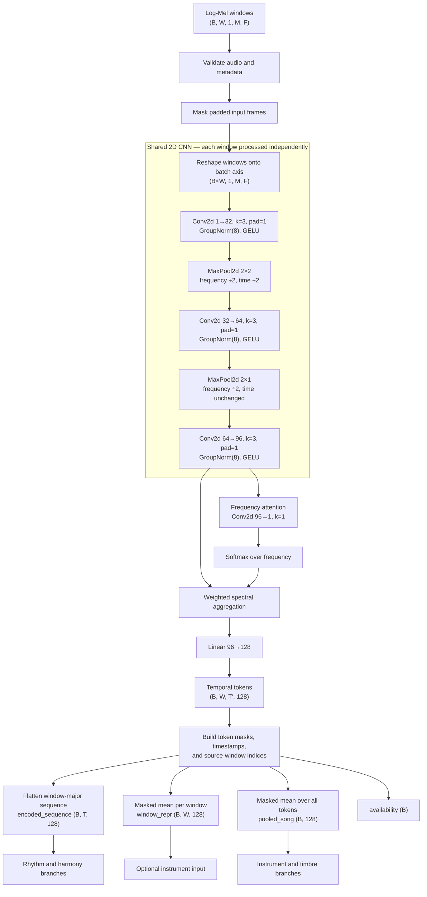
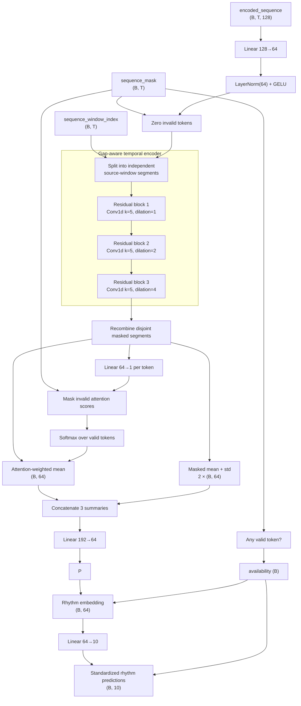

# Rhythm Encoder v1

This document is an editable architecture snapshot for trial-and-error changes to
the shared CNN encoder and rhythm branch. It reflects the current implementations
in:

- `shared_encoder/model.py`
- `rhythm_branch/src/rhythm_branch/model.py`

The shared encoder converts windowed log-Mel spectrograms into ordered 128D
tokens. The rhythm branch processes those tokens without convolving across gaps
between sampled windows, then produces a 64D embedding and ten standardized
rhythm predictions.

## 1. Shared CNN encoder



### Shared encoder defaults and experiment knobs

| Area | Current value | Typical trial changes |
|---|---:|---|
| CNN channels | 32, 64, 96 | Wider/narrower stages |
| Conv kernels | 3×3 | Larger kernels or asymmetric time kernels |
| Normalization | GroupNorm(8) | Group count, BatchNorm, LayerNorm-style alternatives |
| Time downsampling | 2× | More/fewer time-pooling stages |
| Frequency aggregation | Learned softmax attention | Mean/max pooling or multi-head attention |
| Token width | 128 | Change `SHARED_ENCODER_DIM` and rhythm input contract together |
| Temporal receptive field | 12 Mel frames | Kernel, dilation, or depth changes |

## 2. Rhythm branch



Each residual temporal block is:

```text
Input (B,T,64)
  -> Conv1d(64,64,kernel=5,dilation=d,padding=2d)
  -> GELU -> Dropout(0.15)
  -> Conv1d(64,64,kernel=1) -> Dropout(0.15)
  -> residual addition -> LayerNorm(64) -> apply token mask
```

### Rhythm branch defaults

| Config field | Current value | Effect of changing it |
|---|---:|---|
| `input_dim` | 128 | Must match the shared encoder token width |
| `hidden_dim` | 64 | Controls temporal-block and attention capacity |
| `embedding_dim` | 64 | Must match the fusion embedding contract |
| `output_dim` | 10 | Must match the rhythm target schema |
| `temporal_layers` | 3 | Changes temporal depth and dilation sequence |
| `kernel_size` | 5 | Changes local temporal context; must remain odd and ≥3 |
| `dropout` | 0.15 | Regularization inside residual blocks |
| Dilations | 1, 2, 4 | Currently generated as `2 ** layer` |
| Pooling | Attention + masked mean/std | Three summaries followed by `Linear(192,64)` |

Important: preserve source-window separation during experiments. Adjacent positions
in the flattened sequence can come from distant sections of a song, so allowing a
temporal convolution to cross a window boundary creates false rhythmic
transitions.

### Training the rhythm architecture

```bash
python scripts/train_joint.py --seed 42 --epochs 30 --batch-size 1 \
  --lr 3e-4 --weight-decay 1e-4 \
  --out-dir results/rhythm-pooling-attention-mean-std
```

## 3. Shared encoder implementation snapshot

Source: `shared_encoder/model.py`

```python
"""Compact shared CNN producing pooled and ordered branch representations."""

from __future__ import annotations

from typing import Mapping

import torch
from torch import Tensor, nn

from .constants import (
    LOGMEL_HOP_LENGTH,
    LOGMEL_SAMPLE_RATE,
    SHARED_ENCODER_ARCHITECTURE,
    SHARED_ENCODER_DIM,
    TEMPORAL_DOWNSAMPLE,
    TEMPORAL_RECEPTIVE_FIELD_FRAMES,
)
from .geometry import build_temporal_layout
from .types import SharedEncoderOutput
from .validation import input_frame_mask, validate_audio, validate_metadata


class SharedAudioEncoder(nn.Module):
    """2D log-Mel CNN shared by instrument, timbre, rhythm, and harmony.

    Every sampled window is processed independently, preventing convolutions from
    crossing gaps. Metadata-aware calls return every branch representation from the
    same CNN evaluation and autograd graph. ``forward(x)`` without metadata remains
    a window-embedding compatibility path.
    """

    architecture = SHARED_ENCODER_ARCHITECTURE
    temporal_stride_frames = TEMPORAL_DOWNSAMPLE
    temporal_receptive_field_frames = TEMPORAL_RECEPTIVE_FIELD_FRAMES

    def __init__(self, output_dim: int = SHARED_ENCODER_DIM):
        super().__init__()
        if not isinstance(output_dim, int) or isinstance(output_dim, bool) or output_dim < 1:
            raise ValueError("output_dim must be a positive integer")
        self.output_dim = output_dim
        self.cnn = nn.Sequential(
            nn.Conv2d(1, 32, kernel_size=3, padding=1, bias=False),
            nn.GroupNorm(8, 32),
            nn.GELU(),
            nn.MaxPool2d(kernel_size=(2, 2), stride=(2, 2), ceil_mode=True),
            nn.Conv2d(32, 64, kernel_size=3, padding=1, bias=False),
            nn.GroupNorm(8, 64),
            nn.GELU(),
            nn.MaxPool2d(kernel_size=(2, 1), stride=(2, 1), ceil_mode=True),
            nn.Conv2d(64, 96, kernel_size=3, padding=1, bias=False),
            nn.GroupNorm(8, 96),
            nn.GELU(),
        )
        self.frequency_attention = nn.Conv2d(96, 1, kernel_size=1)
        self.proj = nn.Linear(96, output_dim)

    def _encode_feature_map(self, x: Tensor, valid_frames: Tensor) -> Tensor:
        batch, windows, _, input_frames = validate_audio(x)
        clean = x * input_frame_mask(valid_frames, input_frames).to(x.dtype)
        feature_map = self.cnn(clean.reshape(batch * windows, *clean.shape[2:]))
        return feature_map.reshape(batch, windows, *feature_map.shape[1:])

    def _temporal_projection(self, feature_map: Tensor) -> Tensor:
        batch, windows, channels, frequency, tokens = feature_map.shape
        flat = feature_map.reshape(batch * windows, channels, frequency, tokens)
        frequency_weights = torch.softmax(self.frequency_attention(flat), dim=2)
        temporal = (flat * frequency_weights).sum(dim=2).transpose(1, 2)
        return self.proj(temporal).reshape(batch, windows, tokens, self.output_dim)

    def encode_windows(self, x: Tensor) -> Tensor:
        """Return `(B,W,D)` while assuming every supplied frame is real."""
        batch, windows, _, frames = validate_audio(x)
        valid_frames = torch.full((batch, windows), frames, device=x.device, dtype=torch.long)
        temporal = self._temporal_projection(self._encode_feature_map(x, valid_frames))
        return temporal.mean(dim=2)

    def forward(
        self,
        x: Tensor,
        window_mask: Tensor | None = None,
        window_valid_frames: Tensor | None = None,
        window_start_seconds: Tensor | None = None,
        *,
        sample_rate: int = LOGMEL_SAMPLE_RATE,
        hop_length: int = LOGMEL_HOP_LENGTH,
    ) -> SharedEncoderOutput | Tensor:
        """Encode all branch representations in one shared forward pass."""
        metadata = (window_mask, window_valid_frames, window_start_seconds)
        if all(value is None for value in metadata):
            return self.encode_windows(x)
        if any(value is None for value in metadata):
            raise ValueError(
                "window_mask, window_valid_frames, and window_start_seconds "
                "must be supplied together"
            )

        batch, windows, _, _ = validate_audio(x)
        mask, valid_frames, window_starts = validate_metadata(
            x, window_mask, window_valid_frames, window_start_seconds
        )
        temporal = self._temporal_projection(self._encode_feature_map(x, valid_frames))
        layout = build_temporal_layout(
            valid_frames=valid_frames,
            window_mask=mask,
            window_start_seconds=window_starts,
            token_count=temporal.shape[2],
            sample_rate=sample_rate,
            hop_length=hop_length,
        )
        masked_temporal = temporal * layout.token_mask.unsqueeze(-1).to(temporal.dtype)
        flat_temporal = masked_temporal.reshape(batch, -1, self.output_dim)

        window_denominator = (
            layout.token_mask.sum(dim=2, keepdim=True).clamp_min(1).to(temporal.dtype)
        )
        window_repr = masked_temporal.sum(dim=2) / window_denominator
        window_repr = window_repr * mask.unsqueeze(-1).to(window_repr.dtype)
        song_denominator = (
            layout.flat_mask.sum(dim=1, keepdim=True).clamp_min(1).to(temporal.dtype)
        )
        pooled_song = flat_temporal.sum(dim=1) / song_denominator
        availability = layout.flat_mask.any(dim=1)
        pooled_song = pooled_song * availability.unsqueeze(-1).to(pooled_song.dtype)

        return SharedEncoderOutput(
            encoded_sequence=flat_temporal,
            sequence_times=layout.sequence_times,
            sequence_start_times=layout.sequence_start_times,
            sequence_end_times=layout.sequence_end_times,
            sequence_mask=layout.flat_mask,
            sequence_window_index=layout.sequence_window_index,
            pooled_song=pooled_song,
            window_repr=window_repr,
            availability=availability,
        )

    def encode_temporal(
        self,
        x: Tensor,
        window_mask: Tensor,
        window_valid_frames: Tensor,
        window_start_seconds: Tensor,
        *,
        sample_rate: int = LOGMEL_SAMPLE_RATE,
        hop_length: int = LOGMEL_HOP_LENGTH,
    ) -> SharedEncoderOutput:
        """Compatibility alias for the metadata-aware forward pass."""
        output = self.forward(
            x,
            window_mask,
            window_valid_frames,
            window_start_seconds,
            sample_rate=sample_rate,
            hop_length=hop_length,
        )
        if not isinstance(output, SharedEncoderOutput):  # pragma: no cover
            raise RuntimeError("metadata-aware encoder unexpectedly returned a tensor")
        return output

    def set_trainable(self, trainable: bool) -> "SharedAudioEncoder":
        if not isinstance(trainable, bool):
            raise TypeError("trainable must be bool")
        for parameter in self.parameters():
            parameter.requires_grad_(trainable)
        return self

    def freeze(self) -> "SharedAudioEncoder":
        return self.set_trainable(False)

    def unfreeze(self) -> "SharedAudioEncoder":
        return self.set_trainable(True)

    def load_instrument_pretraining(self, checkpoint: Mapping) -> str:
        """Load a complete v2 encoder saved directly or below a known prefix."""
        state = checkpoint.get("model", checkpoint)
        if not isinstance(state, Mapping):
            raise ValueError("instrument checkpoint must contain a model state mapping")
        declared = checkpoint.get("encoder_architecture")
        if declared is not None and declared != self.architecture:
            raise ValueError(
                f"encoder checkpoint architecture {declared!r} is incompatible with "
                f"{self.architecture!r}"
            )
        expected = self.state_dict()
        formats = {
            "shared_cnn_v2": "",
            "shared_cnn_v2_nested": "enc.",
            "shared_cnn_v2_encoder_nested": "encoder.",
        }
        for name, prefix in formats.items():
            mapped = {}
            for key in expected:
                value = state.get(prefix + key)
                if isinstance(value, Tensor) and tuple(value.shape) == tuple(expected[key].shape):
                    mapped[key] = value
            if set(mapped) == set(expected):
                self.load_state_dict(mapped, strict=True)
                return name
        raise ValueError(
            "checkpoint does not contain a complete shared_cnn_audio_encoder_v2; "
            "legacy two-convolution cnn/proj checkpoints are not shape-compatible"
        )

```

## 4. Rhythm branch implementation snapshot

Source: `rhythm_branch/src/rhythm_branch/model.py`

```python
"""Temporal rhythm branch over mel-derived shared-encoder features."""

from __future__ import annotations

from dataclasses import asdict, dataclass, field
from typing import Any, Mapping

import torch
from torch import Tensor, nn

from .constants import N_RHYTHM_FEATURES, RHYTHM_EMBEDDING_DIM, RHYTHM_INPUT_DIM


@dataclass(frozen=True)
class RhythmBranchConfig:
    input_dim: int = RHYTHM_INPUT_DIM
    hidden_dim: int = 64
    embedding_dim: int = RHYTHM_EMBEDDING_DIM
    output_dim: int = N_RHYTHM_FEATURES
    temporal_layers: int = 3
    kernel_size: int = 5
    dropout: float = 0.15
    pooling_mode: str = field(default="attention_mean_std", init=False)

    def __post_init__(self) -> None:
        for name in ("input_dim", "hidden_dim", "embedding_dim", "output_dim", "temporal_layers"):
            if getattr(self, name) < 1:
                raise ValueError(f"{name} must be positive")
        if self.input_dim != RHYTHM_INPUT_DIM:
            raise ValueError(f"shared rhythm input must be {RHYTHM_INPUT_DIM}D")
        if self.embedding_dim != RHYTHM_EMBEDDING_DIM:
            raise ValueError(f"rhythm fusion embedding must be {RHYTHM_EMBEDDING_DIM}D")
        if self.output_dim != N_RHYTHM_FEATURES:
            raise ValueError(f"rhythm regression output must have {N_RHYTHM_FEATURES} fields")
        if self.kernel_size < 3 or self.kernel_size % 2 == 0:
            raise ValueError("kernel_size must be an odd integer >= 3")
        if not 0.0 <= self.dropout < 1.0:
            raise ValueError("dropout must be in [0, 1)")

    def to_dict(self) -> dict[str, Any]:
        return asdict(self)

    @classmethod
    def from_dict(cls, values: Mapping[str, Any]) -> "RhythmBranchConfig":
        config = dict(values)
        legacy_pooling_mode = config.pop("pooling_mode", "attention")
        if legacy_pooling_mode != "attention_mean_std":
            raise ValueError(
                "attention-only rhythm checkpoints are incompatible with the "
                "attention/mean/std pooling architecture"
            )
        return cls(**config)


@dataclass
class RhythmBranchOutput:
    embedding: Tensor  # (B,64), sent to fusion
    predictions: Tensor  # (B,10), standardized AcousticBrainz estimates
    availability: Tensor  # (B,), derived only from mel token availability


class _ResidualTemporalBlock(nn.Module):
    def __init__(self, width: int, kernel_size: int, dilation: int, dropout: float) -> None:
        super().__init__()
        padding = dilation * (kernel_size - 1) // 2
        self.network = nn.Sequential(
            nn.Conv1d(width, width, kernel_size, padding=padding, dilation=dilation),
            nn.GELU(),
            nn.Dropout(dropout),
            nn.Conv1d(width, width, 1),
            nn.Dropout(dropout),
        )
        self.norm = nn.LayerNorm(width)

    def forward(self, values: Tensor, mask: Tensor) -> Tensor:
        update = self.network(values.transpose(1, 2)).transpose(1, 2)
        values = self.norm(values + update)
        return values * mask.unsqueeze(-1).to(values.dtype)


class RhythmBranch(nn.Module):
    """Learn rhythm from ordered shared-CNN features, never from AB inputs.

    When ``sequence_window_index`` is supplied, every selected audio window is
    convolved independently. This prevents temporal kernels from crossing gaps
    between non-adjacent full-song windows.
    """

    def __init__(self, config: RhythmBranchConfig | None = None) -> None:
        super().__init__()
        self.config = config or RhythmBranchConfig()
        self.input_projection = nn.Sequential(
            nn.Linear(self.config.input_dim, self.config.hidden_dim),
            nn.LayerNorm(self.config.hidden_dim),
            nn.GELU(),
        )
        self.temporal_blocks = nn.ModuleList(
            _ResidualTemporalBlock(
                self.config.hidden_dim,
                self.config.kernel_size,
                dilation=2**layer,
                dropout=self.config.dropout,
            )
            for layer in range(self.config.temporal_layers)
        )
        self.attention = nn.Linear(self.config.hidden_dim, 1)
        self.summary_projection = nn.Linear(
            3 * self.config.hidden_dim, self.config.hidden_dim
        )
        self.embedding_head = nn.Sequential(
            nn.Linear(self.config.hidden_dim, self.config.embedding_dim),
            nn.LayerNorm(self.config.embedding_dim),
            nn.GELU(),
        )
        self.regression_head = nn.Linear(self.config.embedding_dim, self.config.output_dim)

    def forward(
        self,
        encoded_sequence: Tensor,
        sequence_mask: Tensor,
        sequence_window_index: Tensor | None = None,
    ) -> RhythmBranchOutput:
        if encoded_sequence.ndim != 3 or encoded_sequence.shape[-1] != self.config.input_dim:
            raise ValueError(
                f"encoded_sequence must have shape (B,T,{self.config.input_dim}), "
                f"received {tuple(encoded_sequence.shape)}"
            )
        if sequence_mask.shape != encoded_sequence.shape[:2]:
            raise ValueError("sequence_mask must have shape (B,T)")
        if not torch.is_floating_point(encoded_sequence) or not torch.isfinite(encoded_sequence).all():
            raise ValueError("encoded_sequence must be finite floating point")
        mask = sequence_mask.to(torch.bool)
        if sequence_window_index is not None:
            if sequence_window_index.shape != mask.shape:
                raise ValueError("sequence_window_index must have shape (B,T)")
            if torch.any(mask & (sequence_window_index < 0)):
                raise ValueError("valid tokens must have a non-negative window index")

        values = self.input_projection(encoded_sequence)
        values = values * mask.unsqueeze(-1).to(values.dtype)
        if sequence_window_index is None:
            values = self._encode_segment(values, mask)
        else:
            # Sum disjoint masked segments. A convolution can therefore see zeros,
            # but never features from the next selected (possibly distant) window.
            encoded = torch.zeros_like(values)
            valid_indices = sequence_window_index.masked_select(mask)
            if valid_indices.numel():
                for window in torch.unique(valid_indices).tolist():
                    segment_mask = mask & (sequence_window_index == int(window))
                    encoded = encoded + self._encode_segment(values, segment_mask)
            values = encoded

        availability = mask.any(dim=1)
        scores = self.attention(values).squeeze(-1)
        scores = scores.masked_fill(~mask, torch.finfo(scores.dtype).min)
        # Softmax over an all-masked row is undefined. Supply a harmless temporary
        # position, then erase the resulting pooled value with availability.
        safe_mask = mask.clone()
        if bool((~availability).any()):
            safe_mask[~availability, 0] = True
            scores = scores.masked_fill(~safe_mask, torch.finfo(scores.dtype).min)
            scores[~availability, 0] = 0
        weights = torch.softmax(scores, dim=1) * mask.to(scores.dtype)
        attention_mean = (values * weights.unsqueeze(-1)).sum(dim=1)
        valid = mask.unsqueeze(-1).to(values.dtype)
        count = valid.sum(dim=1).clamp_min(1)
        masked_mean = (values * valid).sum(dim=1) / count
        centered = (values - masked_mean.unsqueeze(1)) * valid
        variance = centered.square().sum(dim=1) / count
        # Avoid sqrt(0)'s undefined derivative while retaining an exact zero
        # for constant, single-token, and all-masked sequences.
        positive_variance = variance > 0
        safe_variance = torch.where(
            positive_variance, variance, torch.ones_like(variance)
        )
        masked_std = torch.sqrt(safe_variance) * positive_variance.to(values.dtype)
        pooled = self.summary_projection(
            torch.cat((attention_mean, masked_mean, masked_std), dim=-1)
        )
        embedding = self.embedding_head(pooled)
        embedding = embedding * availability.unsqueeze(-1).to(embedding.dtype)
        predictions = self.regression_head(embedding)
        predictions = predictions * availability.unsqueeze(-1).to(predictions.dtype)
        return RhythmBranchOutput(embedding, predictions, availability)

    def _encode_segment(self, values: Tensor, mask: Tensor) -> Tensor:
        result = values * mask.unsqueeze(-1).to(values.dtype)
        for block in self.temporal_blocks:
            result = block(result, mask)
        return result
```

## 5. Architecture-edit checklist

When changing these architectures for an experiment:

1. Keep the shared encoder output width and `RhythmBranchConfig.input_dim` equal.
2. Recalculate temporal stride and receptive-field constants after changing CNN
   pooling, convolution kernels, or dilation.
3. Keep `sequence_mask` and `sequence_window_index` behavior intact unless the
   sampling policy itself changes.
4. Give incompatible checkpoints a new architecture identifier instead of
   partially loading mismatched weights.
5. Run the shared encoder, rhythm branch, and integration tests before training:

   ```bash
   pytest tests/test_shared_audio_encoder.py \
          tests/test_rhythm_branch.py \
          tests/test_shared_encoder_branch_integration.py
   ```
